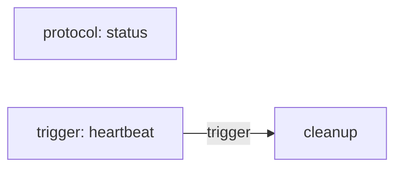

<p align="center">
  
</p>

<h1 align="center">Loutre</h1>

<p align="center">
  <strong>Graph-first TypeScript Application Framework</strong><br>
  One application. Any runtime. Visible architecture.
</p>

<p align="center">
  HTTP、Task、Trigger、Queueなどを明示的なApplication Graphとして組み立て、RuntimeとDeveloper Toolingから同じApplication modelを利用します。
</p>

<p align="center">
  <a href="https://loutrejs.come25136.id">Website</a> ·
  <a href="./docs/getting-started.md">Getting Started</a> ·
  <a href="./examples/">Examples</a>
</p>

<p align="center">
  <a href="https://github.com/come25136/loutrejs/actions/workflows/ci.yml"></a>
  <a href="https://www.npmjs.com/package/@loutrejs/loutre"></a>
  <a href="./LICENSE"></a>
</p>

## Application Graph

LoutreではApplication DefinitionをRuntime固有の起動処理から分離し、Application Graphへcompileします。HTTP endpointもbackground executionも同じGraphに参加するため、Runtimeと`loutre check`、`loutre graph`、OpenAPI、buildが同じ構成を参照できます。

たとえば、HTTP Moduleと定期TaskをひとつのApplicationとして宣言します。

```ts
export default defineApplication({
  modules: [ApiModule()],
  triggers: [heartbeat],
})
```

GraphはCLIからそのまま確認できます。

```sh
npm exec loutre -- graph executions --entry src/app.ts --format mermaid
```

次の図は、この構成に対する`loutre graph`のMermaid出力です。



Application Graphは可視化専用の表現ではありません。Module、dependency、Contract、execution、Runtime capabilityを検査し、Developer ToolingとRuntimeの共通モデルとして利用します。

## Quick Start

```sh
npm create loutre@latest my-app
cd my-app
npm run dev
```

BunやDenoからもprojectを作成できます。

```sh
bun create loutre my-app
deno x -A npm:create-loutre@latest my-app
```

Node.js、Bun、Deno、Cloudflare Workers、AWS Lambda向けのstarterを選択できます。

## Why Loutre

Applicationが大きくなるほど、HTTP、background task、queue、configuration、DI、deploymentの境界は複雑になります。Loutreはそれらを個別の仕組みとして増やすのではなく、ひとつのApplication DefinitionとApplication Graphから扱います。

構成を明示的なTypeScript codeとして保つことで、RuntimeとDeveloper Toolingが同じApplication modelを共有できます。Frameworkのmagicより、型と構造から追える設計を優先しています。

## Runtime Support

Application codeをRuntime固有APIから分離し、Host / Runtime Adapterから実行環境へ接続します。

- Node.js
- Bun
- Deno
- Cloudflare Workers
- AWS Lambda
- Electron

Runtimeごとの役割と対応範囲は[Getting Started](./docs/getting-started.md)と[Architecture](./docs/architecture.md)を参照してください。

## Features

- **Application Graph** — Module、dependency、Contract、execution、Runtime capabilityをひとつのGraphとして検査
- **Unified execution model** — HTTP、Task、Trigger、Queueを同じApplication modelで表現
- **Portable Application** — Application DefinitionとRuntime固有のHostを分離
- **Type-safe composition** — Contract、DI、Pipeline、Environment、ArgumentsをTypeScriptで接続
- **Explicit architecture** — decoratorやfilesystem discoveryに依存せず、構成をcodeから追跡可能
- **Developer Tooling** — validation、Graph visualization、OpenAPI、deployment artifact生成を提供

## Examples

実行可能なprojectを[`examples/`](./examples/)に置いています。

- [`hello-http`](./examples/hello-http/) — Contract、Implementation、DIを使うHTTP Application
- [`hello-cli`](./examples/hello-cli/) — Argumentsを受け取りTaskを実行するApplication
- [`hello-worker`](./examples/hello-worker/) — `fixedDelay` TriggerでTaskを定期実行するWorker
- [`basic-auth`](./examples/basic-auth/) / [`bearer-auth`](./examples/bearer-auth/) — HTTP認証
- [`database-postgres`](./examples/database-postgres/) / [`database-drizzle-postgres`](./examples/database-drizzle-postgres/) / [`database-prisma-postgres`](./examples/database-prisma-postgres/) — Database integration

## Documentation

- [Website](https://loutrejs.come25136.id)
- [Getting Started](./docs/getting-started.md) — project作成、HTTP、Task、Runtime、CLI
- [Architecture](./docs/architecture.md) — Application Definition、Application Graph、Runtimeの境界
- [Examples](./examples/) — HTTP、Auth、CORS、Worker、Database

## Packages

| Package                                                              | Role                                    |
| -------------------------------------------------------------------- | --------------------------------------- |
| [`@loutrejs/loutre`](https://www.npmjs.com/package/@loutrejs/loutre) | Core Application API / Runtime bindings |
| [`@loutrejs/node`](https://www.npmjs.com/package/@loutrejs/node)     | Node.js HTTP Runtime Adapter            |
| [`@loutrejs/bullmq`](https://www.npmjs.com/package/@loutrejs/bullmq) | BullMQ Queue binding                    |
| [`@loutrejs/cli`](https://www.npmjs.com/package/@loutrejs/cli)       | Graph / build / OpenAPI tooling         |
| [`create-loutre`](https://www.npmjs.com/package/create-loutre)       | Project initializer                     |

## Project Status

> [!WARNING]
> Loutreは現在v0.xです。Public APIには破壊的変更が入る可能性があります。

設計の一貫性を優先しながらPublic APIを整備しています。Productionで利用する場合は、利用するversionを固定し、release notesを確認してください。

## Contributing

```sh
npm install
npm run verify
```

テストは責務ごとに3層へ分けています。

- `npm run test:unit` — frameworkの部品単体を検証
- `npm run test:integration` — `integrations/` のApplication / Moduleを使って境界を検証
- `npm run test:e2e` — `examples/` の実コマンドを起動し、外部境界からproject全体を検証

`integrations/` はテスト専用資産、`examples/` は利用者向けの実行可能projectです。

## License

[MIT](./LICENSE)
