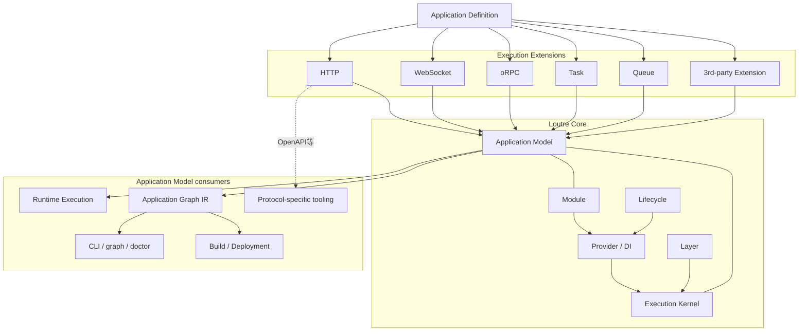
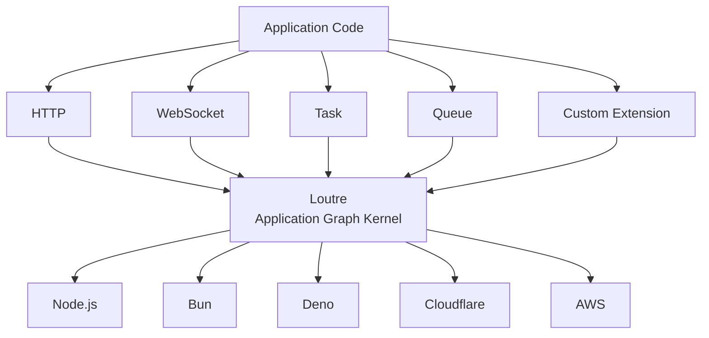
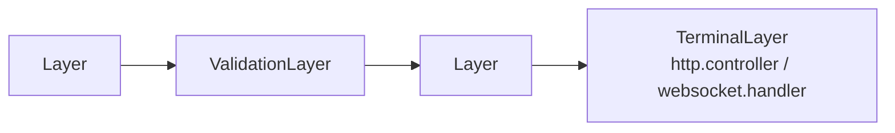
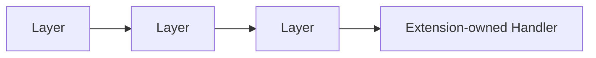
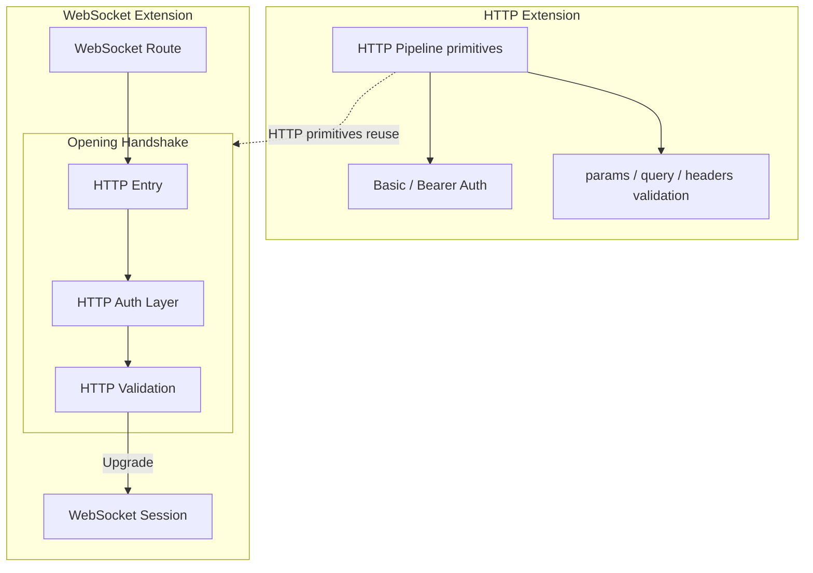
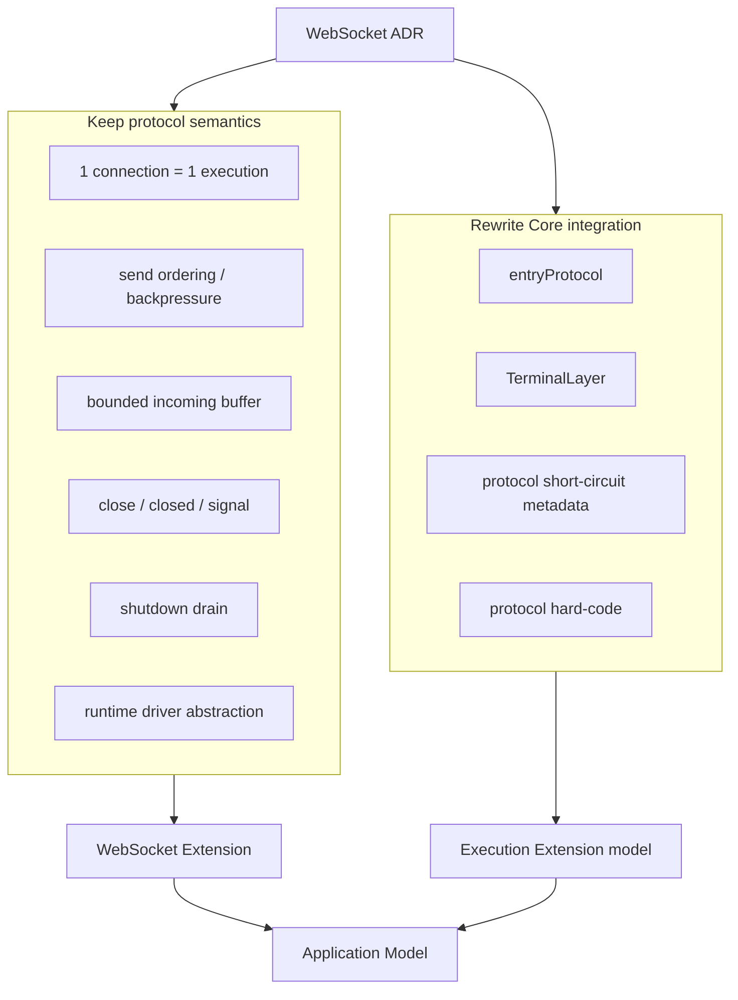
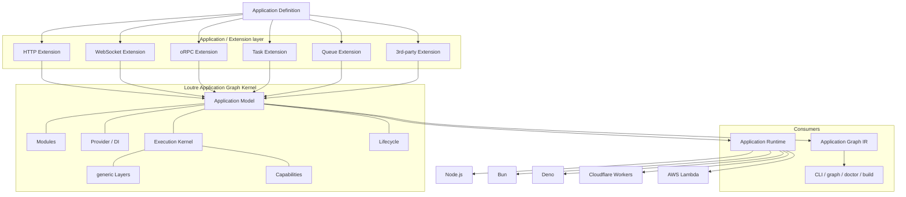

# Loutre Application Graph Kernel Architecture

Status: **Proposed / Design Frozen**

Date: 2026-09-05 JST

Target: Loutre v0 full breaking redesign

実装担当向け注意:

- 本ADRはLoutre Core再設計のSource of Truthとする。
- 後方互換性は維持しない。互換alias、deprecated bridge、旧`ProtocolDescriptor`互換層は作らない。
- Loutreの中心価値を「Web Framework」ではなく「Application Graph Kernel」として定義する。
- HTTP、WebSocket、MessagePort、Queue等のtransport semanticsをCoreへ持ち込まない。
- WebSocket ADRで定義済みのconnection lifecycle、ordering、backpressure、drain等のprotocol semanticsは維持するが、現在のProtocol Coreへの統合方法は本ADRに従って再設計する。
- API名や型表現より、責務境界を優先する。実装時にCoreへprotocol-specific special caseを戻してはならない。

---

## 0. Decision summary

Loutre Coreを0から再設計し、Coreの責務を次へ限定する。

```text
Application Graph Kernel
├ Application Definition / Model
├ Module boundary
├ Provider / DI
├ Lifecycle
├ Execution registration / lifetime
├ generic Layer composition
├ Runtime capability requirement
└ Graph projection / diagnostics
```

次の概念はCoreから削除する。

```text
Contract
Procedure
ProtocolDescriptor
ProtocolFactory
ProtocolGroup
Core Implementation
TerminalLayer
ValidationLayer
ValidatedInputPart
requiresValidated
protocol-specific ShortCircuitDeclaration
entryProtocol
HasHttp / HasMessagePort 等のprotocol名hard-code
```

HTTP、WebSocket、oRPC、Task、Queue等は**Execution Extension**としてApplication ModelへExecutionをcontributeする。



Loutre CoreはHTTP path、status code、WebSocket handshake、queue acknowledgement等を理解しない。

Coreが理解するのは、Applicationを構成するnode、dependency、execution、lifecycle、capabilityのみとする。

---

## 1. Why redesign now

現在のLoutreは次の変換を行う。

```text
Protocol DSL
   ↓
ProtocolGroup
   ↓
Contract
   ↓
Procedure
   ↓
ProtocolDescriptor
   ↓
Implementation
   ↓
Pipeline
   ↓
Application Graph
   ↓
Protocol Execution
```

HTTP route treeのようなprotocol固有構造は、一度Coreの`Procedure + ProtocolDescriptor`へ正規化され、その後Application Graphへ再び変換される。

この設計はHTTP / MessagePortを一般化する段階では有効だった。

しかしWebSocket設計により、次の問題が明確になった。

### 1.1 Protocolを増やすたびCoreの抽象が増える

WebSocketを現在のCoreへ統合するには、少なくとも次の概念が必要になった。

```text
entryProtocol
interaction = duplex
WebSocket terminal
HTTP short-circuit compatibility
Protocol capability generalization
Protocol execution drain
```

これらは個別には合理的だが、Protocol追加のたびにCoreへ「Protocolを一般化するための概念」が増える構造になっている。

### 1.2 CoreがHTTP semanticsを既に知っている

`ValidatedInputPart`のようなCore型が、実質的には次を知っている。

```text
params
query
headers
body
```

これはHTTPのinput modelであり、Application Graph Kernelの概念ではない。

同様にprotocol-specific short-circuit declaration、terminal protocol matching等もCoreがtransport semanticsを理解している証拠である。

### 1.3 ProcedureによるProtocol束縛がApplication semanticsとして弱い

現在は概念上、次を表現できる。

```text
users.get
├ HTTP
└ MessagePort
```

しかしHTTP implementationとMessagePort implementationは別であり、共有したいbusiness logicは通常Provider / Serviceへ置く。

```text
HTTP execution -------┐
                      ├── UserService.get()
MessagePort execution ┘
```

したがって「複数Protocolを1 Procedureに束ねる」ことをCoreの中心概念にする必要性は低い。

### 1.4 GraphとRuntime objectの境界が曖昧

Runtimeはfactory、handler、native binding等のlive JavaScript objectを必要とする。

一方CLI / build / graph visualizationはserializable metadataを必要とする。

両者を同一のGraph objectとして扱おうとすると、実際にはlive registryとIRの二重構造が発生する。

本ADRではこれを明示的に分離する。

---

## 2. Core principle

新しいLoutreの定義は次とする。

> **Loutre is a TypeScript Application Graph Kernel.**

LoutreはHTTP frameworkそのものではない。

LoutreはWebSocket frameworkそのものではない。

LoutreはDI containerだけでもない。

LoutreはApplicationの構造、dependency、execution、lifecycle、runtime requirementを静的に組み立て、それをRuntimeとToolingの共通sourceから利用できるようにするKernelである。



---

## 3. Core must not know execution kinds

Core implementation内で次を禁止する。

```ts
if (execution.kind === 'http') {
  // ...
}
```

```ts
switch (protocol) {
  case 'http':
  case 'websocket':
}
```

```ts
type HasHttp<TApplication> = ...
```

Coreがexecution kindを識別子として保持すること自体は合法とする。

```ts
executionKind: 'http.request'
executionKind: 'websocket.session'
executionKind: 'task'
```

ただしCoreはその文字列の意味を解釈しない。

用途は次に限定する。

- Graph identity
- diagnostics
- extension lookup
- Runtime binding lookup
- Tooling projection

---

## 4. Application Model and Graph IR

### 4.1 Canonical source is the Application Model

新Loutreでは、runtime executionに必要なlive JavaScript objectを含むcanonical representationを**Application Model**と呼ぶ。

```text
Application Definition
        │
        ▼
  Application Model
        │
        ├────────────► Runtime
        │
        ▼
     projection
        │
        ▼
 Application Graph IR
        │
        ├ CLI
        ├ graph
        ├ doctor
        ├ build
        └ deployment tooling
```

Application Modelはserializableである必要はない。

次を保持してよい。

```text
factory function
handler factory
runtime extension hooks
schema object
opaque extension metadata
live token identity
```

### 4.2 Graph IR is a projection

Application Graph IRはApplication Modelから導出されるserializable projectionとする。

IRはRuntimeのSource of Truthではない。

RuntimeとToolingが別々にApplication Definitionを解釈することは禁止する。

正しい関係は次。

```text
                  Application Definition
                           │
                           ▼
                  Application Model
                    /              \
                   /                \
                  ▼                  ▼
              Runtime             Graph IR
                                     │
                               Developer Tooling
```

つまり「RuntimeとToolingが同じGraph objectを使う」のではなく、

> **RuntimeとToolingが同じApplication Modelから導出される**

ことを保証する。

---

## 5. Application Model is graph-shaped

Application Model自体はgraph-shapedな構造として扱う。

概念形:

```ts
interface ApplicationModel {
  readonly nodes: readonly ApplicationNode[]
  readonly edges: readonly ApplicationEdge[]
  readonly extensions: readonly ApplicationExtension[]
}
```

node kindのCore setは最小限にする。

```text
module
provider
execution
lifecycle
framework
```

Extensionは追加metadataをnodeへ付与できるが、Core node kindを無制限に増やさない。

例えばHTTP routeはCoreから見るとexecution nodeである。

```text
execution
  id = users.get
  executionKind = http.request
  metadata = <HTTP extension-owned metadata>
```

WebSocket routeもexecution node。

```text
execution
  id = realtime.chat
  executionKind = websocket.session
  metadata = <WebSocket extension-owned metadata>
```

---

## 6. Generic Execution model

Coreが持つexecutionの概念形は次。

```ts
interface ExecutionContribution<
  TKind extends string = string,
  TMetadata = unknown,
> {
  readonly kind: 'execution'
  readonly id: string
  readonly executionKind: TKind

  readonly capabilities: readonly CapabilityRequirement[]
  readonly metadata: TMetadata

  readonly dependencies: readonly DependencyReference[]

  // Runtimeで利用するlive extension-owned value。
  // Graph IRへserializeしない。
  readonly runtime: unknown
}
```

重要なのは、Coreが`runtime`や`metadata`のshapeを理解しないこと。

Execution Extensionが理解する。

```text
HTTP Extension
  ├ build HTTP DSL
  ├ type HTTP handler
  ├ publish ExecutionContribution
  ├ execute HTTP request
  └ project HTTP metadata

WebSocket Extension
  ├ build WebSocket DSL
  ├ type session handler
  ├ publish ExecutionContribution
  ├ execute connection
  └ project WebSocket metadata
```

Coreはexecution registration、dependency、lifecycle、capabilityを扱う。

---

## 7. Execution Extension

Execution ExtensionはCoreへ新しいexecution semanticsを接続する境界である。

概念形:

```ts
interface ExecutionExtension<
  TName extends string = string,
  THostApi extends object = {},
> {
  readonly kind: 'execution-extension'
  readonly name: TName

  createRuntime(
    context: ExecutionExtensionRuntimeContext,
  ): ExecutionExtensionRuntime | Promise<ExecutionExtensionRuntime>

  project?(context: ExecutionProjectionContext): unknown

  readonly host?: HostExtension<THostApi>
}
```

実際の型表現は実装時に最小化してよい。

本ADRで固定するのは次のsemantic boundary。

- Extensionは自分のExecution metadataを所有する。
- Extensionは自分のdispatch / matchingを所有する。
- Extensionは自分のhandler Context型を所有する。
- Extensionは自分のresult / response semanticsを所有する。
- Extensionは自分のPipeline compatibilityを所有する。
- Extensionは自分のruntime driver boundaryを所有する。
- Extensionは必要なRuntime capabilityを宣言する。
- CoreはExtension名やexecution kindをhard-codeしない。

---

## 8. Contract is not a Core concept

Coreの`ContractDefinition`、`ProcedureDefinition`、`ProtocolGroup`を削除する。

Contractという用語を禁止するわけではない。

Contract ownershipをExtensionへ移動する。

### 8.1 HTTP example

HTTP packageは必要なら独自Contractを公開できる。

```ts
const UsersApi = http.contract({
  users: {
    get: {
      method: 'GET',
      path: '/users/{id}',
      request: {
        params: {
          id: z.string(),
        },
      },
      responses: {
        found: {
          status: 200,
          body: User,
        },
      },
    },
  },
})
```

### 8.2 WebSocket example

WebSocket packageは別のContract semanticsを持てる。

```ts
const Realtime = websocket.contract({
  chat: {
    path: '/rooms/{roomId}/chat',
    messages: websocket.json({
      input: ClientMessage,
      output: ServerMessage,
    }),
  },
})
```

### 8.3 External framework integration

Loutre Core Contractへ変換する必要はない。

```ts
const Api = orpcLoutre(router)
```

```text
oRPC router
    │
    ▼
@loutrejs/orpc
    │
    ▼
ExecutionContribution
    │
    ▼
Application Model
```

これによりLoutre自身がHTTP RPC Contract DSLを再発明し続ける必要がなくなる。

---

## 9. Core Implementation is removed

現在のCore `implementation({ contract, protocol, procedures, factory })`を削除する。

Implementation typingはExecution Extensionが所有する。

HTTPがContract / Implementation splitを必要とする場合はHTTP packageで定義する。

```ts
const UsersController = http.implementation({
  contract: UsersApi,

  factory: (users = inject(UserService)) => ({
    async get(ctx) {
      return ctx.response.found({
        body: await users.get(ctx.params.id),
      })
    },
  }),
})
```

WebSocketも独自implementation shapeを持てる。

```ts
const RealtimeController = websocket.implementation({
  contract: Realtime,

  factory: (rooms = inject(RoomService)) => ({
    async chat(ctx) {
      for await (const message of ctx.messages) {
        // ...
      }
    },
  }),
})
```

Coreから見ると、どちらも最終的にはExecutionContributionを生成するExtension-owned definitionである。

Coreはhandler名、Context、Resultを推論しない。

---

## 10. Module owns executions

ModuleはProviderに加えてExecutionを所有できる。

概念形:

```ts
const UsersModule = defineModule(() => ({
  providers: [UserRepository, UserService],
  executions: [UsersController],
}))
```

Core Moduleの責務は次。

```text
Module
├ imports
├ providers
├ executions
├ lifecycle
├ exports
└ capability requirements
```

`implementations`というCore slotは削除する。

HTTP packageが`implementation`というpublic API名を使うことは構わないが、Moduleから見ればExecution contributionである。

---

## 11. Layer remains, but becomes generic

LayerはLoutreの重要な概念として残す。

ただしCore Layerからprotocol semanticsを削除する。

Core Layerの責務は次のみ。

- executionのaround composition
- execution-local state contribution
- DI dependency declaration
- nested composition
- static metadata publication

概念:

```text
Layer before
    │
    ▼
  next()
    │
    ▼
 downstream execution
    │
    ▼
Layer after
```

### 11.1 TerminalLayer is removed

現在:



新設計:



Handlerがpipeline terminalであることはExecution Extensionのexecution semanticsから自明とする。

Coreにterminal markerを置かない。

### 11.2 ValidationLayer is removed

Coreは次を知らない。

```text
params
query
headers
body
message payload
queue payload
```

HTTP validationはHTTP ExtensionのLayer / pipeline item。

WebSocket message decode / validationはWebSocket Extensionの責務。

Queue payload validationはQueue Extensionの責務。

### 11.3 `requiresValidated` is removed

validation ordering / type refinementはExtension-owned pipeline type systemが検査する。

Coreに`ValidatedInputPart`を追加しない。

### 11.4 Core Layer does not define protocol short-circuit metadata

次を削除する。

```ts
interface ShortCircuitDeclaration {
  protocol: string
  response: string
}
```

Layer outcomeが必要な場合、その型とruntime semanticsはExecution Extensionが所有する。

Core runtimeはLayer compositionを可能にするが、そのreturn valueをHTTP response等として解釈しない。

---

## 12. Cross-cutting Layer compatibility

Protocol semanticsをCoreから消しても、transaction、tracing、tenancy等のcross-cutting Layerは共有できる必要がある。

そのためCore LayerはExtension-neutralなexecution stateへcontributionできる。

```ts
const transaction = layer({
  name: 'database.transaction',
  state: type<{ transaction: Transaction }>(),

  factory:
    (database = inject(Database)) =>
    async (_ctx, next) => {
      return database.transaction(async (transaction) => {
        return next({ transaction })
      })
    },
})
```

HTTP / WebSocket / Task等は、自分のbase ContextへCore execution stateを合成する。

```text
HTTP Context
+ execution state
= HTTP handler context

WebSocket Context
+ execution state
= WebSocket handler context
```

Extension-specific requirementがあるLayerはExtension側で定義する。

例:

```text
basicAuth       -> HTTP Extension
validateHeaders -> HTTP Extension
transaction     -> Core-compatible generic Layer
tracing         -> Core-compatible generic Layer
```

---

## 13. WebSocket no longer needs `entryProtocol`

WebSocket opening handshakeはHTTP semanticsを利用する。

しかしこの関係をCoreへ`entryProtocol`として登録しない。

現在案:

```text
protocol      = websocket
entryProtocol = http
```

新設計:



つまり、

> WebSocket ExtensionがHTTP Extension primitivesをcompositionする

のであり、

> WebSocketとHTTPの継承関係をCoreが理解する

のではない。

この方針はGraphQL-over-WebSocket等にも適用する。

CompositionはExtension間で行い、Coreにtransitive protocol relationを作らない。

---

## 14. WebSocket ADR consequences

既存WebSocket ADRのうち、WebSocket semanticsは維持する。

### Keep

```text
1 connection = 1 Application execution
ordered ctx.send()
transport backpressure
bounded incoming buffering
ctx.close()
ctx.closed
ctx.signal
abnormal close normalization
handler completion semantics
shutdown drain
Close 1001 Going Away
force terminate fallback
runtime driver abstraction
json / text / binary codecs
```

### Rewrite

次は本ADRにより廃止または再設計する。

```text
ProtocolDescriptor.entryProtocol
websocket.handler TerminalLayer
Protocol short-circuit compatibility
ProtocolDescriptor interaction integration
Core protocol capability derivation
Core protocol dispatch identity
```

図:



---

## 15. Dispatch belongs to Extension

Core `dispatchKey`を削除する。

HTTP route duplicate detection、WebSocket path duplicate detection、MessagePort method duplicate detection等はExtensionが所有する。

理由:

- dispatch identityはtransport semanticsそのもの。
- HTTPはmethod + normalized path。
- WebSocketはupgrade intent + normalized path。
- Queueはdriver / queue identity。
- Taskはhost invocation identity。

Coreへ共通string `dispatchKey`を押し込めると、結局Extension semanticsを文字列へencodeするだけになる。

Application Modelにはdiagnostics / graph identity用のstable execution idを持つ。

```text
users.http.get
realtime.websocket.chat
cleanup.task
```

ただしこのidをtransport dispatchに使用する必要はない。

---

## 16. Interaction mode is Extension metadata

Core `InteractionMode`を削除する。

```text
unary
server-stream
client-stream
duplex
```

これらはProtocolを比較するための便利な分類ではあるが、Core runtimeのexecution semanticsとして必要ではない。

HTTP Extensionはresponse streamingを理解する。

WebSocket Extensionはduplex sessionを理解する。

oRPC ExtensionはRPC streaming semanticsを理解する。

Toolingへ共通interaction classificationを公開したい場合はGraph projectionのoptional descriptive metadataとして扱い、Core type systemの分岐条件にはしない。

---

## 17. Capability model stays generic

Runtime capability requirementはCoreに残す。

ただしcapability derivationはExtensionが宣言する。

```text
HTTP Extension
  -> requires http.server

WebSocket Extension
  -> requires websocket.server

Crypto Layer
  -> requires crypto.random
```

Core Graph compilerは次だけを行う。

```text
Extension / Provider / Layer
        │
        ▼
capability requirements
        │
        ▼
Application Model
        │
        ▼
Runtime capability validation
```

Coreに次を置かない。

```ts
if (execution.executionKind === 'http.request') {
  require('http.server')
}
```

---

## 18. Host API is contributed by Extension

現在のようなCore型を増やし続けない。

```text
HasHttp
HasMessagePort
HasWebSocket
HasQueue
HasScheduler
```

代わりにExtensionがHosted Application APIをcontributeする。

例:

```ts
app.http.fetch(request)
app.tasks.run(cleanup)
app.triggers.start()
```

WebSocketが独立したHost APIを必要としない場合はcontributeしなくてよい。

概念形:

```ts
interface HostExtension<TApi extends object> {
  create(context: HostExtensionContext): TApi
}
```

Hosted Application型はApplication Definitionに含まれるExtension contributionsから生成する。

```ts
type HostedApplication<TDefinition> = BaseApplication &
  HostExtensionsOf<TDefinition>
```

Coreは`http`というnamespace名を知らない。

Extension間で同一Host namespaceが衝突した場合はApplication compile errorとする。

---

## 19. Runtime boundary

Runtime AdapterはCore Application RuntimeとExecution Extension Runtimeをbindする。

```text
Application Model
       │
       ▼
Application Runtime
       │
       ├ Provider / DI
       ├ Lifecycle
       ├ active execution registry
       └ Extension runtimes
               │
       ┌───────┼─────────┐
       ▼       ▼         ▼
      HTTP    WebSocket  Task
       │       │         │
       └───────┼─────────┘
               ▼
         Runtime Adapter
```

Node / Bun / Deno等のnative APIはExecution ExtensionまたはRuntime Adapter boundaryに閉じ込める。

Core Application Runtimeへ`upgradeWebSocket()`のようなAPIを追加しない。

---

## 20. Execution lifetime

CoreはProtocolを知らないが、active execution lifetimeは管理する。

```ts
interface ExecutionLease {
  readonly signal: AbortSignal
  close(): void
}
```

実際のAPI名は実装時に調整してよいが、semanticは次。

```text
Extension starts execution
        │
        ▼
Core registers active execution
        │
        ▼
Extension executes its semantics
        │
        ▼
execution completes
        │
        ▼
Core unregisters active execution
```

HTTPなら1 request。

WebSocketなら1 connection。

Taskなら1 invocation。

Queue consumerがTaskを起動するなら、consumer listener自身とTask executionのlifetimeを混同しない。

---

## 21. Drain lifecycle

Long-lived transportのdrainはExtensionが所有する。

Coreはshutdown orchestrationだけを一般化する。

```text
Application close
      │
      ├ stop accepting new work
      │
      ▼
Extension drain hooks
      │
      ├ HTTP listener stop
      ├ WebSocket 1001 drain
      ├ Queue consumer stop
      └ Trigger stop
      │
      ▼
wait active executions == 0
      │
      ▼
Provider lifecycle cleanup
```

概念:

```ts
interface ApplicationExtensionRuntime {
  drain?(): Promise<void>
  close?(): Promise<void>
}
```

WebSocket-specific drain semanticsをCoreへ追加しない。

---

## 22. Extension projection and Tooling

Graph IRはCore metadataに加えてExtension projectionを持てる。

概念:

```ts
interface ExecutionIR {
  readonly id: string
  readonly executionKind: string
  readonly module?: string
  readonly capabilities: readonly string[]
  readonly extension: {
    readonly name: string
    readonly metadata?: unknown
  }
}
```

`metadata`はJSON-serializableでなければならない。

Runtime-only objectはGraph IRへ入れない。

HTTP ExtensionはTooling用metadataをprojectできる。

```text
method
path
response variants
schema identities
OpenAPI metadata
```

WebSocket Extensionなら、例えば次。

```text
path
message codec
input/output availability
```

CLI Coreはmetadataを理解する必要がない。

Protocol-specific renderer/pluginが理解する。

---

## 23. OpenAPI ownership

OpenAPI generationはHTTP Extensionの責務とする。

```text
Application Model
      │
      ▼
HTTP Extension executions
      │
      ▼
HTTP projection
      │
      ▼
OpenAPI generator
```

Core Application Graph compilerがHTTP definitionをinspectしない。

将来AsyncAPIや独自protocol toolingを追加する場合も同じmodelを使う。

---

## 24. Third-party Extension requirement

新Coreの成立条件として、Loutre repository外からExecution Extensionを作れることを必須とする。

第三者Extension追加にCore source変更が必要なら、このADRの設計は失敗とみなす。

Conformance fixtureとして少なくとも1つのtest-only custom Extensionを作る。

例:

```ts
const ping = customExecution({
  name: 'ping',
  // ...
})
```

Core testでは次を検証する。

- Application Modelへ登録できる。
- DI dependencyを解決できる。
- capability requirementをGraphへ出せる。
- host extensionをcontributeできる。
- runtime extensionをbindできる。
- Graph IRへopaque metadataをprojectできる。
- Coreにexecution kind hard-codeが不要。

---

## 25. Public API direction

本ADRは各Extension DSLの最終APIを固定しない。

ただしApplication authorから見える責務は次の形へ寄せる。

```ts
const UsersApi = http.contract({
  // HTTP semantics
})

const UsersController = http.implementation({
  contract: UsersApi,
  factory: /* ... */,
})

const Realtime = websocket.implementation({
  contract: RealtimeContract,
  factory: /* ... */,
})

const AppModule = defineModule(() => ({
  providers: [UserService],
  executions: [UsersController, Realtime],
}))

export default defineApplication({
  modules: [AppModule()],
})
```

重要なのは、Core APIに次が現れないこと。

```text
protocol: http
ProtocolDescriptor
ProtocolFactory
ProcedureDefinition
TerminalLayerDescriptor
entryProtocol
```

---

## 26. Package boundary

論理package boundaryは次とする。

```text
@loutrejs/loutre
  Application Graph Kernel
  ├ Application
  ├ Module
  ├ Provider / DI
  ├ Lifecycle
  ├ Execution Kernel
  ├ generic Layer
  └ Graph Model / IR

@loutrejs/http
  HTTP Execution Extension
  ├ route / contract
  ├ pipeline
  ├ auth helpers
  ├ client
  └ OpenAPI

@loutrejs/websocket
  WebSocket Execution Extension
  ├ route / contract
  ├ handshake composition
  ├ codec
  ├ session lifecycle
  └ runtime driver boundary
```

Task / Trigger / Queue等を物理的に別npm packageへ分けるかは別ADRで決定してよい。

ただしCore source上ではそれらもExecution / Extension modelを通し、special caseを作らない。

HTTPとWebSocketはtransport dependency boundaryを明確にするため、Core packageから論理的に分離する。

---

## 27. Removed architecture

次の現在API / internal modelは削除対象。

```text
core/contract
  ContractDefinition
  ProcedureDefinition
  ProtocolDescriptor
  ProtocolFactory
  ProtocolGroup

core/implementation
  ImplementationDescriptor
  implementation()

core/layer
  ValidationLayerDescriptor
  TerminalLayerDescriptor
  ValidatedInputPart
  requiresValidated
  protocol short-circuit declarations

Graph IR
  ContractIR
  ContractProcedureIR
  ContractProtocolIR
  PipelineIR.protocol
  ImplementationIR.protocol
  ProtocolExecutionRootIR
```

上記概念に依存するHTTP / MessagePort / Application binding / CLIコードはExtension modelへ移行する。

---

## 28. New Graph IR direction

Graph IRはentity arrayの寄せ集めではなく、canonical node / edge projectionを中心にする。

概念:

```ts
interface ApplicationGraphIR {
  readonly nodes: readonly GraphNodeIR[]
  readonly edges: readonly GraphEdgeIR[]
  readonly diagnostics: readonly Diagnostic[]
}
```

node:

```ts
type GraphNodeIR =
  | ModuleNodeIR
  | ProviderNodeIR
  | ExecutionNodeIR
  | LifecycleNodeIR
  | FrameworkNodeIR
```

edge例:

```text
owns
imports
exports
injects
requires
starts
wraps
```

利用者向けAPIではprojection indexを提供してよい。

```ts
graph.modules
graph.providers
graph.executions
```

ただしこれらはSource of Truthではなくderived indexとする。

---

## 29. Type-system rule

TypeScriptの型はApplication architectureを補助するが、Coreの概念を型推論の都合だけで増やさない。

禁止例:

```text
HTTP validationを型推論するためCoreへValidatedInputPartを追加
WebSocket typingのためCoreへentryProtocolを追加
terminal位置推論のためCoreへTerminalLayerを追加
```

代わりに、type refinementの所有者であるExtensionが型を持つ。

```text
HTTP type system
  owns params/query/headers/body refinement

WebSocket type system
  owns messages/send/close session typing

Core type system
  owns Module / DI / execution state / host extension composition
```

型システム上の都合がCore runtime architectureを逆流して決めてはならない。

---

## 30. Static construction rule stays

Application Model構築は同期・side-effect freeを維持する。

次のfactory / declarationをinspectするだけでlistenerやbusiness operationを開始してはならない。

```text
Module construction
Provider declaration
Layer declaration
Execution declaration
Extension registration
```

Runtime side effectはbind / initialize / execute段階へ限定する。

これによりApplication ModelとGraph IRをApplication実行なしで生成できる。

---

## 31. DI and Lifecycle stay first-class

Provider / DI / Lifecycleは新Coreの中心概念として維持する。

Application-owned resourceはProviderへ置く。

```text
Database connection
Cache client
Repository
Service
Configuration
```

request / connection / task invocation固有値はexecution state / Contextへ置く。

```text
current user
transaction
request id
tenant
permissions
```

WebSocket専用connection DI scope等はCoreへ追加しない。

将来execution scopeを導入する場合はgeneric execution lifetimeへ対応させる。

```text
HTTP request      -> one execution scope
WebSocket session -> one execution scope
Task invocation   -> one execution scope
```

---

## 32. Extension-to-extension composition

Extensionは他Extensionのpublic primitivesへ依存できる。

WebSocket opening handshakeが代表例。

```text
@loutrejs/websocket
       │
       └── uses HTTP handshake primitives
                 │
                 ▼
           @loutrejs/http
```

Coreはこのdependencyをsemantic inheritanceとして解釈しない。

package dependency / Extension dependencyとして扱う。

循環依存を避けるため、共有するtransport-neutral primitiveが必要になった場合のみ最小単位を抽出する。

「HTTPとWebSocketが両方使うからCoreへ移す」は自動的な理由にならない。

---

## 33. Error ownership

Core errorはApplication Kernelのerrorに限定する。

例:

```text
Module composition error
Dependency resolution error
Capability mismatch
Extension collision
Execution registration error
Lifecycle failure
```

HTTP error、WebSocket codec error、queue errorはExtensionが所有する。

```text
HttpRequestDecodeError
WebSocketMessageDecodeError
WebSocketConnectionNotOpenError
QueuePayloadValidationError
```

Coreへprotocol-specific error classを追加しない。

---

## 34. Diagnostics ownership

DiagnosticsはCoreとExtension双方がcontributeできる。

Core diagnostics:

```text
duplicate module identity
missing provider export
circular dependency
missing runtime capability
host namespace collision
extension registration failure
```

HTTP diagnostics:

```text
duplicate method/path
invalid route path
response contract mismatch
pipeline incompatibility
```

WebSocket diagnostics:

```text
duplicate websocket route
invalid handshake pipeline
codec incompatibility
```

Application Graph IRは両者を統合して表示する。

---

## 35. Migration strategy

互換layerは作らない。

実装は新architectureを横に完成させてから現在architectureを削除する。

推奨順序:

1. Application Model foundation
   - canonical live node / edge model
   - Graph IR projection
   - Extension registry

2. Execution Kernel
   - execution contribution
   - active execution lifetime
   - generic capability requirement
   - extension runtime lifecycle

3. Module / DI integration
   - `executions` ownership
   - execution factory dependency collection
   - lifecycle integration

4. Layer simplification
   - Core generic Layer
   - TerminalLayer削除
   - ValidationLayer削除
   - protocol short-circuit metadata削除

5. HTTP Extension migration
   - HTTP Contract ownership
   - HTTP Implementation ownership
   - HTTP pipeline typing
   - dispatch
   - auth
   - OpenAPI
   - host API

6. MessagePort / Task / Trigger migration
   - Core hard-codeを使わずExtension modelで成立させる

7. WebSocket Extension
   - existing WebSocket ADR semanticsを新Extension modelへ実装

8. Runtime adapters
   - Node
   - Bun
   - Deno
   - Cloudflare Workers
   - AWS Lambda

9. Delete old architecture
   - Contract Core
   - ProtocolDescriptor
   - Core Implementation
   - old Graph IR
   - `HasHttp`等のprotocol-specific Core types

10. Documentation / examples rewrite

---

## 36. Required conformance tests

新Core完成条件として以下を必須にする。

### Core

- custom third-party execution kindをCore変更なしで登録できる。
- custom extension metadataをGraph IRへprojectできる。
- custom host namespaceをHosted Applicationへcontributeできる。
- capability requirementをExtensionから宣言できる。
- ModuleがExecutionを所有できる。
- Execution factoryのDI dependencyがGraphへ現れる。
- active executionがApplication shutdownに参加する。
- extension drain hookがprovider cleanupより前に実行される。

### Architecture regression

repository内Core sourceに次のhard-codeが存在しないことをtest / lintで検査する。

```text
protocol === 'http'
protocol === 'websocket'
HasHttp
HasWebSocket
entryProtocol
TerminalLayerDescriptor
ValidatedInputPart
```

単なる文字列fixture / docsは除外してよい。

### HTTP Extension

- method/path dispatch
- nested route composition
- validation
- auth short-circuit
- streaming
- OpenAPI
- host fetch

### WebSocket Extension

- HTTP handshake primitive reuse
- auth before Upgrade
- 1 connection = 1 execution
- send ordering
- backpressure
- local / remote / abnormal close
- bounded incoming buffering
- shutdown 1001 drain

---

## 37. Non-goals

本ADRでは次を決めない。

- HTTP DSLの最終syntax
- WebSocket message routing DSL
- custom WebSocket codec API
- exact Graph IR versioning format
- npm package数の最終決定
- distributed application graph
- remote DI
- infrastructure provisioning
- generic transport abstraction
- all protocolsを共通Request/Response modelへ正規化すること

特に最後を重要なNon-goalとする。

```text
HTTP Request/Response
WebSocket session/messages
Queue delivery/ack
Task invocation
```

を1つの巨大なgeneric transport interfaceへ押し込めない。

Extensionごとのsemanticsを維持する。

---

## 38. Consequences

### Positive

- Loutreの中心価値がApplication Graphへ明確に集中する。
- HTTP / WebSocket追加でCoreのProtocol abstractionが膨張しない。
- third-party Execution ExtensionをCore変更なしで作れる。
- oRPC等の既存ecosystemをLoutre Application Graphへ直接統合しやすい。
- HTTP固有のvalidation / short-circuit / dispatchをCoreから除去できる。
- WebSocketのHTTP handshake reuseを`entryProtocol`なしで自然に表現できる。
- RuntimeとToolingのSource of TruthをApplication Modelへ一本化できる。
- TypeScript型の都合でCore runtime conceptを増やす圧力を減らせる。
- Graph IRを本当のnode / edge projectionとして整理できる。

### Negative

- HTTP package側の責務が増える。
- Extension authorがruntime / typing / projection boundaryを理解する必要がある。
- 現行Contract / Protocol / Implementation型を全面的に書き換える必要がある。
- Application Graph IRとCLI toolingを大きく変更する必要がある。
- v0利用者にはmigration pathではなくrewriteに近いbreaking changeとなる。
- Extension間compositionのdependency設計を慎重に行う必要がある。

これらは、Core architectureの長期的一貫性と引き換えに許容する。

---

## 39. Final architecture



Coreから見た最終ルールは単純である。

```text
Application code
   ↓
Execution Extensions contribute Application semantics
   ↓
Application Model records structure and live runtime bindings
   ↓
Loutre Kernel manages dependency, lifecycle, execution and capability
   ↓
Runtime executes the Model
Graph IR projects the same Model for Tooling
```

Loutreは「すべてのProtocolを自分の共通Protocol modelへ変換するframework」ではなく、

> **異なるApplication execution semanticsを、共通のApplication Graph / DI / Lifecycleへ接続するKernel**

として再設計する。
