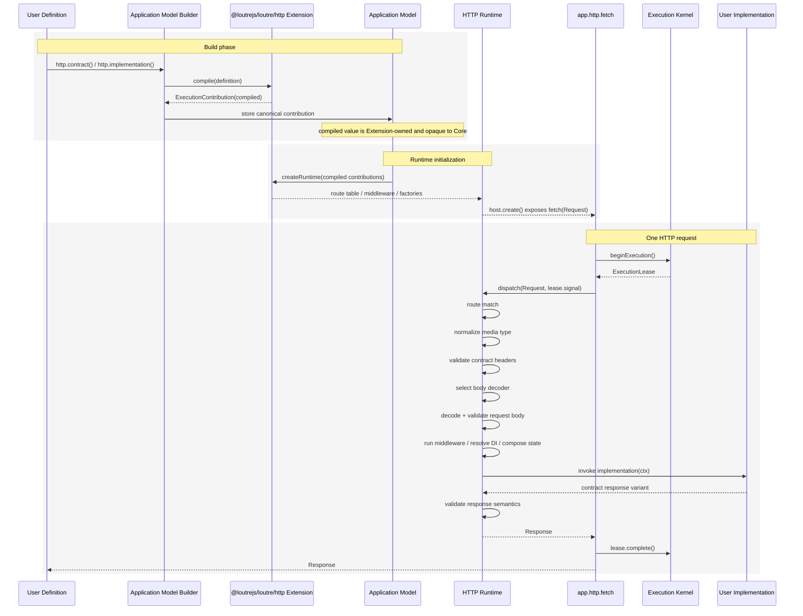

# Loutre Application Graph Kernel Architecture

Status: **Proposed / Design Frozen**

Date: 2026-09-05 JST

Target: Loutre v0 full breaking redesign

## 1. 決定

Loutre CoreをProtocol中心のWeb Framework Coreではなく、**TypeScript Application Graph Kernel**として定義する。

Coreの責務は次に限定する。

```text
Application Graph Kernel
├ Application Definition / Model
├ Module boundary
├ Provider / DI
├ Lifecycle
├ Execution registration / active lifetime
├ Runtime capability
├ generic Layer composition
└ Graph IR / diagnostics
```

HTTP、WebSocket、Task、MessagePort、Queue等の実行semanticsはCoreへ追加せず、Execution Extensionとして接続する。

```text
Application Definition
        │
        ▼
Execution Definition -- Extension.compile()
        │
        ▼
Application Model (canonical)
        │
        ├── Runtime
        └── Graph / CLI / Build / protocol tooling
```

Application ModelをRuntimeとToolingの共通Source of Truthとする。RuntimeやCLIが生のDSLを独自に再解釈してはならない。

## 2. ADRの責務分担

このADRは**Coreの責務境界とApplication Modelの位置付け**だけを正本とする。

Execution Extensionの具体的なcontractについては、次のADRを唯一の正本とする。

- `docs/adr/loutre_execution_extension_contract_architecture.md`

具体的には以下を本ADRでは再定義しない。

- `ExecutionExtension`の型shape
- `ExecutionContribution`の`compiled` shape
- `compile()` / `validate()` / `createRuntime()` / `project()`
- Runtime Capability binding
- `ExecutionLease.abort()` / `complete()`
- Extension `drain()` / `close()`
- shutdown ordering
- Host API composition

WebSocket固有のconnection lifecycle、ordering、backpressure、close semanticsはWebSocket ADRを正本とする。

この分離により、同じinterfaceやlifecycleを複数ADRへ転写して矛盾させない。

## 3. Coreが知るもの

### 3.1 Application Model

Application Definitionから一度だけbuildされるcanonical modelを持つ。

Modelは少なくとも次を保持する。

```text
modules
providers
executions
extensions
runtime capability requirements
graph nodes / edges
diagnostics
```

Extension-owned compiled valueはopaqueとして保持する。Coreはそのshapeを解釈しない。

### 3.2 Module / Provider / DI

ModuleはProviderの所有境界とvisibilityを定義する。

visibility violationやmissing dependencyはApplication Model diagnosticとして検出し、error diagnosticが存在するModelはRuntime開始前に拒否する。

Container実装が内部的にflat lookupを利用していても、Module visibilityをadvisoryにはしない。

### 3.3 Lifecycle

CoreはApplication/Module/Provider lifecycleを管理する。

Extension-owned listener、consumer、scheduler等のresource cleanup順序はExecution Extension contract ADRのshutdown orderに従う。

### 3.4 Active Execution

CoreはHTTP request、WebSocket connection、Task invocation等の意味を知らない。

Coreが管理するのは「現在activeなapplication workが存在する」というlifetimeだけである。

active execution APIの具体的な語彙とabort/complete semanticsはExecution Extension contract ADRに従う。

### 3.5 Runtime Capability

ExtensionはRuntimeが必要とするplatform primitiveをtyped capabilityとして要求できる。

Capabilityの参照identityは`runtimeCapability(id)`が`Symbol.for()`で生成するstableなglobal symbol identityとする。`id`はApplication Model・Graph IR・diagnostic・論理Capability identityに使うstable identifierであり、bundle/import境界でtoken objectが複製されても同じ`id`なら同じCapabilityとして解決できる。Coreはこのidentityをopaqueなlookup keyとして扱う。

### 3.6 generic Layer

Coreはprotocol-neutralなLayer composition primitiveを提供できる。

Core Layerは次だけを扱う。

```text
context
state contribution
DI dependency
runtime capability
next()
outcome passthrough
```

HTTP response variant、WebSocket close code等のprotocol-specific short-circuit semanticsは各Extensionが所有する。

## 4. Coreが知らないもの

Coreへ次を持ち込まない。

```text
HTTP path / method / status / headers / body
WebSocket handshake / frame / close code
MessagePort message shape
Task scheduler semantics
Queue acknowledgement
OpenAPI semantics
protocol-specific validation ordering
protocol-specific short-circuit declaration
```

Coreの型に`HasHttp`、`HasMessagePort`等の新しいprotocol hard-codeを追加しない。

現在残るlegacy `HasHttp`等は既存Host compatibility pathの移行用surfaceであり、新Application Graph Kernelの概念ではない。新しいExtension機能はそこへ追加しない。

## 5. Execution Extension境界

各Extensionは自分のDSLと実行semanticsを所有する。

例:

```text
@loutrejs/loutre/http
├ HTTP Contract
├ request/response validation
├ route matching
├ middleware compatibility
├ CORS / auth semantics
├ Runtime fetch API
└ OpenAPI projection source

@loutrejs/websocket
├ handshake contract
├ connection/session lifecycle
├ message codec
├ backpressure
└ WebSocket projection
```

Coreは`executionKind`やExtension名をopaque identifierとして扱い、値によるprotocol-specific分岐を行わない。

## 6. Runtime adapter境界

Platform adapterはCoreとExtension Host APIをplatform primitiveへbindする。

Node HTTPの例:

```text
@loutrejs/loutre/http
  app.http.fetch(Request) -> Response
                │
                ▼
@loutrejs/node
  node:http IncomingMessage / ServerResponse binding
```

`@loutrejs/node`へHTTP Contractやroute validation semanticsを持たせない。

同様にCloudflare Workers、Deno、Bun等もExtensionが公開するuniversal Host APIをplatformへ接続する。

## 7. Tooling / Graph IR

Graph IRはApplication Modelからprojectionする。

```text
Definition
  ↓ compile once
Application Model
  ├ Runtime consumes compiled contribution
  └ Tooling projects compiled contribution
```

Graphへlive handler、factory、native resourceをserializeしない。

Extension projectionはJSON-serializableでなければならない。

OpenAPI等のprotocol-specific toolingはCore Graph IRそのものへHTTP semanticsを埋め込まず、HTTP Extensionが所有するcompiled contributionから生成する。

## 8. HTTPに対する含意

Application Modelを正本とするため、HTTP Runtime実装の都合でContract semanticsを暗黙に変更しない。

例としてrequest bodyを宣言する場合、ContractがContent-Typeを特定できることを要求する。

```ts
request: {
  headers: z.object({
    'content-type': z.literal('application/json'),
  }),
  body: CreateUser,
}
```

Runtimeは次の順序で処理する。

```text
raw request headers
  ↓ media type normalization
Contract headers validation
  ↓ validated content-type
body decoder selection
  ↓
Contract body validation
```

「runtimeがJSONっぽいからdecodeする」のではなく、Contractでvalidateされたrepresentationに従ってdecodeする。

複数representationを将来導入する場合もdecoderの暗黙分岐を増やすのではなく、Contract/APIとして先に表現する。

### 8.1 HTTP requestのbuild/runtime flow

HTTP Definitionからrequest実行までの責務境界は次の通りとする。



Build phaseでDefinitionは一度だけcompileされ、requestごとに再compileしない。RuntimeはApplication Modelに保持されたcanonical compiled contributionから構築する。

HTTP固有のroute matching、header/body validation、decoder selection、middleware short-circuit、response semanticsはHTTP Extensionが所有する。Coreがrequest execution中に理解するのはactive application workとしての`ExecutionLease`と、generic Layer / DI等のprotocol-neutral primitiveだけである。

Middlewareがresponseをshort-circuitした場合はUser Implementationの呼び出しを省略するが、返されたvariantのContract整合性とHTTP response semanticsの検証責務は引き続きHTTP Extensionにある。

## 9. Package / source boundary

Execution Extensionのarchitecture境界を、そのままnpm package境界にはしない。HTTPは追加dependencyや独立install lifecycleを持たないため、`@loutrejs/loutre/http` subpathとして`@loutrejs/loutre`本体へ配置する。

```text
@loutrejs/loutre
├ core / application / runtime
│   └─ must not depend on ./http
└ http
    ├─ may depend on public Core primitives
    └─ must not depend on Node.js built-ins

@loutrejs/websocket ──────> @loutrejs/loutre/http
@loutrejs/tasks ──────────> @loutrejs/loutre
@loutrejs/message-port ───> @loutrejs/loutre
```

同一npm package内でもHTTP semanticsをCoreへ逆流させない。`packages/loutre/src/http`とCoreのsource boundary、およびHTTPからNode.js built-inへの非依存はdependency-cruiserでCI enforcementする。

Extension間依存は原則禁止し、protocol integrationとして必要なものだけ明示allowlistにする。WebSocket handshakeがHTTP semanticsを利用するため、`@loutrejs/websocket -> @loutrejs/loutre/http`は許可された依存とする。

別npm packageとして配布するExtensionについては、source importだけでなく`dependencies`、`peerDependencies`、`devDependencies`も境界テスト対象とする。

## 10. Compatibility方針

このPRの中心はApplication Graph KernelとExecution Extensionへの破壊的移行である。

ただし、未移行subsystemの利用者体験を無関係に壊すための変更は行わない。

現在Trigger EngineはExecution Extension化の対象外であり、`hello-worker`は既存Trigger APIを維持するためlegacy Host pathを意図的に使用する。このcompatibility pathへ新機能は追加せず、Trigger Engineを再設計するPRで別途移行する。

HTTP/CORS等、今回Extensionへ移行する領域では既存の外向きsemanticsを原則維持する。変更が必要な場合はruntime実装都合ではなくContract/API仕様として明示する。

## 11. Non-goals

このADRでは以下を決めない。

- WebSocket message-level API詳細
- Queue Extension API
- Trigger EngineのExtension化
- distributed DI
- hot reload
- dynamic module mutation
- protocolごとのobservability format

## 12. 完了条件

Application Graph Kernel移行は次を満たしたとき完了とする。

- Coreに新しいprotocol-specific special caseがない
- DefinitionからApplication Modelへのcompileが一度だけ行われる
- RuntimeとToolingが同じcompiled contributionを利用する
- Extension package boundaryがtestで強制される
- active execution lifecycleがExecution Extension contract ADRと一致する
- Host API生成失敗を含む初期化失敗がrollbackされる
- HTTP等の既存Contract invariantをExtension移行で失わない
- examplesとREADMEが同じAPIを示す
- breaking migrationがchangesetに明記される
