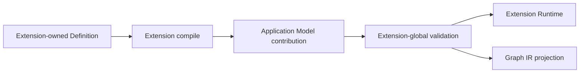
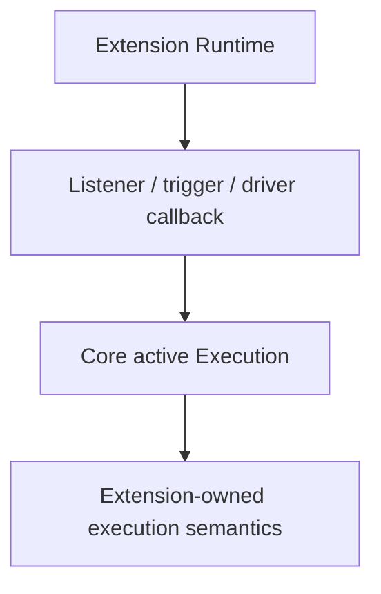
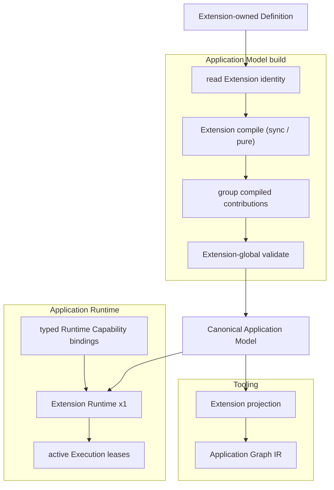

# Loutre Execution Extension Contract Architecture

Status: **Proposed / Design Frozen**

Date: 2026-09-05 JST

Target: Loutre v0 full breaking redesign

Related: `loutre_application_graph_kernel_architecture.md`

本ADRはApplication Graph Kernel ADRの実装境界を補完する。

Application Graph Kernel ADRが「何をCoreから追い出すか」を定義するのに対し、本ADRは第三者Execution ExtensionをCore変更なしで成立させるための**definition -> Application Model -> Runtime / Graph IR**契約を定義する。

本ADRとApplication Graph Kernel ADRが競合する場合、Execution Extensionのcompile / runtime capability binding / active execution contractについては本ADRを優先する。

---

## 0. Review findings

Application Graph Kernel ADRを実装可能性の観点でレビューした結果、次の境界は追加で固定する必要がある。

1. Extension-owned DSL / definitionをApplication Modelへ変換するcanonical hookが必要。
2. Runtime capabilityは名前だけでなく、native driver / service valueを型付きでExtensionへ渡せなければならない。
3. dispatch duplicate等のExtension-global validationは全Execution contributionが揃った後に実行する必要がある。
4. Hosted Applicationの型はprotocol名ではなく、登録されたExtension identityから合成する必要がある。
5. listener / consumer / scheduler等のapplication-lifetime runtime resourceと、request / session / task等のactive execution lifetimeを分離する必要がある。
6. `ExecutionLease.close()`はtransport closeと意味が衝突するため、active execution registryからの完了通知には別語彙を使用する。

これらを曖昧なまま実装すると、Runtime AdapterやGraph compilerへ再び`http` / `websocket`等のhard-codeが戻る可能性があるため、本ADRでSource of Truth化する。

---

## 1. Canonical flow

Execution Extensionは次の一方向flowに従う。



重要:

- Runtimeが元のDSL / definitionを再解釈しない。
- Graph projectorが元のDSL / definitionを再解釈しない。
- RuntimeとToolingは**compile済みApplication Model contribution**を共通sourceとする。
- Extension compileはApplication Model構築段階で完了する。

これにより、同じHTTP route definitionからRuntimeとOpenAPIが別ロジックで異なる解釈をすることを防ぐ。

---

## 2. Execution Definition carries Extension identity

Moduleの`executions`へ登録できるvalueは、Coreが理解可能な最小のExecution Definition identityを持つ。

概念形:

```ts
declare const executionDefinitionBrand: unique symbol

interface ExecutionDefinition<
  TExtension extends ExecutionExtension = ExecutionExtension,
> {
  readonly kind: 'execution-definition'
  readonly extension: TExtension
  readonly [executionDefinitionBrand]: true
}
```

HTTP / WebSocket等のpublic DSL object自体のshapeはExtensionが自由に決めてよい。

ただしModuleへ登録する最終valueから、Coreは次だけを取得できなければならない。

```text
this is an Execution Definition
which Extension owns it
```

CoreはdefinitionのHTTP method、path、schema、handler等をinspectしない。

### 2.1 Extension identity is object identity first

Extensionのruntime groupingにはExtension descriptorのobject identityを使用する。

`name`はGraph / diagnostics用のstable identifierであり、runtime dispatchの主identityにしない。

```ts
const httpExtension = defineExecutionExtension({
  name: '@loutrejs/http',
  // ...
})
```

同一Application Model内に同じ`name`を持つ別Extension descriptorが存在する場合はcompile errorとする。

これにより誤って別version / duplicate package instanceが同一namespaceとして混在する問題を検出できる。

---

## 3. Extension compile hook

Execution Extensionはdefinitionをcanonical Application Model contributionへ変換する同期compile hookを持つ。

概念形:

```ts
interface ExecutionExtension<
  TDefinition extends ExecutionDefinition = ExecutionDefinition,
  TCompiled = unknown,
  THostApi extends object = {},
> {
  readonly kind: 'execution-extension'
  readonly name: string

  compile(
    definition: TDefinition,
    context: ExecutionCompileContext,
  ): ExecutionContribution<TCompiled>

  validate?(
    context: ExecutionExtensionValidationContext<TCompiled>,
  ): readonly Diagnostic[]

  createRuntime(
    context: ExecutionExtensionRuntimeContext<TCompiled>,
  ): ExecutionExtensionRuntime | Promise<ExecutionExtensionRuntime>

  project?(
    context: ExecutionProjectionContext<TCompiled>,
  ): JsonValue | undefined

  readonly host?: HostExtension<THostApi>
}
```

API名は実装時に調整してよいが、semantic boundaryは固定する。

### 3.1 compile is synchronous and side-effect free

`compile()`は同期かつside-effect freeでなければならない。

禁止:

```text
network I/O
listener start
opening database connection
starting timer
reading runtime-only native state
business operation
```

許可:

```text
route tree resolution
schema identity registration
handler / factory reference retention
DI dependency declaration
capability requirement declaration
static metadata normalization
```

Application Model構築だけでApplicationを実行してはならない。

### 3.2 compile exactly once per definition

同じApplication Model buildにおいて、1 Execution Definitionに対するExtension compileは1回だけ行う。

Runtime / Graph IR generation時に再compileしない。

```text
Definition
   │
   └── compile once
          │
          ▼
   compiled contribution
      ├ Runtime
      └ Graph projection
```

---

## 4. Compiled Execution Contribution

Coreへ渡るExecution contributionはCore metadataとExtension-owned compiled valueを分離する。

概念形:

```ts
interface ExecutionContribution<TCompiled = unknown> {
  readonly kind: 'execution'
  readonly id: string
  readonly executionKind: string
  readonly extension: ExecutionExtension

  readonly dependencies: readonly DependencyReference[]
  readonly capabilities: readonly RuntimeCapabilityRequirement[]

  readonly compiled: TCompiled
}
```

Coreが理解するfield:

```text
id
executionKind as opaque identifier
extension identity
dependencies
capabilities
```

Coreが理解しないfield:

```text
compiled
```

`compiled`にはHTTPならresolved route definition / implementation binding、WebSocketならresolved route / codec / handler binding等を保持できる。

Runtime-only function referenceを保持してよい。

Graph IRへは直接serializeしない。

---

## 5. Extension-global validation

duplicate route等は1 definition単体では検出できない場合がある。

そのためApplication Model builderは全definitionをcompileした後、Extension単位にgroupしてvalidationを実行する。

```text
all definitions
      │
      ▼
compile individually
      │
      ▼
group by extension identity
      │
      ▼
extension.validate(all compiled contributions)
```

例:

```text
HTTP
  duplicate method + normalized path

WebSocket
  duplicate upgrade route

Task
  duplicate host invocation name
```

Coreはduplicate semanticsを理解しない。

Core自身はCore identity collisionのみ検査する。

```text
duplicate Application node id
duplicate Extension name
host namespace collision
```

---

## 6. Projection must use compiled contribution

Extension Graph projectionはcompiled contributionから生成する。

```ts
project({ execution }) {
  // execution.compiled is canonical
}
```

元のpublic DSL objectを別途walkしてはならない。

理由:

- RuntimeとToolingの解釈差を防ぐ。
- nested route resolve等を二重実装しない。
- static diagnosticsとRuntime dispatch identityを同じcanonical normalizationから導出する。

Projection resultはJSON-serializableでなければならない。

Coreはprojection内容を解釈しない。

Projectionが非serializable valueを返した場合はGraph projection diagnosticとする。

---

## 7. Runtime Capability is a typed binding

Runtime capabilityを単なるstring requirementとして終わらせない。

Extension runtimeは実際にnative driver / serviceへアクセスする必要がある。

そのためCore capabilityはtyped token + runtime bindingとして扱う。

概念形:

```ts
declare const runtimeCapabilityType: unique symbol

interface RuntimeCapability<TValue> {
  readonly id: string
  readonly [runtimeCapabilityType]?: TValue
}

function runtimeCapability<TValue>(id: string): RuntimeCapability<TValue>
```

例:

```ts
const HTTP_SERVER = runtimeCapability<HttpServerDriver>('http.server')

const WEBSOCKET_SERVER =
  runtimeCapability<WebSocketServerDriver>('websocket.server')
```

Coreは`http.server`の意味を知らない。

### 7.1 Requirement

Execution / Layer / Extensionはcapability tokenをrequireする。

```ts
capabilities: [HTTP_SERVER]
```

Graph IRではstable `id`だけをprojectできる。

```text
http.server
websocket.server
crypto.random
```

### 7.2 Runtime binding

Runtime Adapter / Runtime Featureはcapability tokenへvalueをbindする。

概念形:

```ts
interface RuntimeCapabilityBindings {
  get<T>(capability: RuntimeCapability<T>): T
}
```

Extension runtime:

```ts
const driver = context.capabilities.get(HTTP_SERVER)
```

Coreはvalueをopaqueに受け渡すだけ。

### 7.3 Third-party runtime support

第三者ExtensionのためにCore / official Node adapter本体へhard-code追加を要求してはならない。

必要ならExtension packageはRuntime-specific featureを提供できる。

```text
@acme/loutre-protocol
@acme/loutre-protocol-node
@acme/loutre-protocol-bun
```

Host / deployment boundaryがRuntime Featureを組み込む。

Official adapterがofficial Extension capability providerをbundleすることは許可するが、それはCore semanticsではない。

---

## 8. Extension Runtime is one per Application Runtime

同じExtension descriptorに属するExecutionが複数存在しても、Extension RuntimeはApplication Runtimeごとに原則1つ生成する。

```text
HTTP execution A ─┐
HTTP execution B ─┼── HTTP Extension Runtime x1
HTTP execution C ─┘
```

`createRuntime()`にはそのExtensionのcompiled contributions一覧を渡す。

```ts
createRuntime({ executions, capabilities, applicationRuntime })
```

これによりExtension runtimeは一度だけdispatch table / session registry等を構築できる。

Extensionが内部でexecutionごとのruntime objectを作ることは自由。

Coreはそのshapeを知らない。

---

## 9. Application-lifetime Runtime vs active Execution

Extension Runtimeのlifetimeとactive Execution lifetimeを混同しない。

### Application-lifetime Runtime

例:

```text
HTTP listener / dispatch registry
WebSocket session registry
queue consumer listener
cron scheduler
```

これはApplication Runtime初期化からdrain / closeまで存在できる。

### Active Execution

例:

```text
1 HTTP request
1 WebSocket connection
1 Task invocation
1 Queue delivery handling execution
```

これはCore active execution registryへ参加する。



Queue consumer listener自体を永続active executionとして数えない。

Cron timer loop自体をTask executionとして数えない。

listener / timerはExtension Runtime resourceであり、発火したworkがExecutionになる。

---

## 10. Active Execution Lease

Application Graph Kernel ADRの概念`ExecutionLease.close()`は名称を変更する。

`close`はWebSocket connection等のApplication semanticと衝突するため、Core registry lifetimeには使用しない。

概念形:

```ts
interface ExecutionLease {
  readonly signal: AbortSignal

  abort(reason?: unknown): void
  complete(): void
}
```

### 10.1 `abort()`

execution-local cooperative cancellationをsignalする。

`abort()`だけではactive execution registryから削除しない。

```text
abort
  -> signal.aborted = true
  -> execution can unwind
  -> still active until complete
```

### 10.2 `complete()`

Executionのruntime workが完全に終了したことをCoreへ通知し、active registryから削除する。

idempotentとする。

`complete()`時にsignalが未abortなら、execution lifetime終了としてsignalをabortしてよい。

### 10.3 Extension semantic remains owner

Coreの`abort()`をtransport operationとして扱わない。

WebSocket ExtensionではApplication Graph Kernelからのshutdown開始だけを理由に即`abort()`しない。

WebSocket ADR通り、drainによるconnection closeがCLOSEDへ到達した時点でexecution lifetimeを終了する。

HTTP client disconnect等でいつ`abort()`するかもHTTP Extensionが決める。

---

## 11. Drain order

Application shutdown orderを次に固定する。

```text
1. stop accepting new application work
2. call Extension Runtime drain hooks
3. wait active Execution count == 0
4. call Extension Runtime close hooks
5. cleanup Provider / DI lifecycle
```

`drain()`の責務:

```text
new ingressを止める
existing long-lived workへgraceful completionを要求する
```

`close()`の責務:

```text
active executionsが0になった後のExtension-owned runtime resource cleanup
```

Extension runtimeの`close()`よりProvider cleanupを先に実行してはならない。

Extension runtimeがProviderへ依存している可能性があるためである。

### 11.1 Drain race

Coreが「new work stopped」と判定した後、Extensionが新規Execution Leaseを開始してはならない。

`beginExecution()`はApplication Runtimeのstateを確認し、draining開始後の新規leaseを拒否する。

WebSocket Upgrade commit race等はExtension側でcommit直前にもstateを確認してよい。

---

## 12. Host API typing comes from Extension identity

Hosted Application APIはexecution kind文字列ではなく、Application Definition内に存在するExtension descriptor typeから合成する。

概念:

```ts
type ExtensionsOf<TApplication> = ExtensionOfExecutionDefinitions<
  ModulesOf<TApplication>
>

type HostedApplication<TApplication> = BaseApplication &
  HostApisOf<ExtensionsOf<TApplication>>
```

Coreは次を行わない。

```ts
type HasHttp<T> = ...
type HasWebSocket<T> = ...
```

### 12.1 Namespace collision

Host APIはExtensionごとにstable namespaceを宣言する。

```ts
http.host -> { http: HttpHostApi }
tasks.host -> { tasks: TaskHostApi }
```

同じApplicationに同一namespaceをcontributeする別Extensionが存在した場合はstatic/runtime compile errorとする。

型レベルでも可能な範囲でcollisionを検出する。

---

## 13. Layer compatibility boundary

Core generic LayerとExtension-specific Layerを区別する。

### 13.1 Core-compatible Layer

transport semanticsを必要としない。

例:

```text
transaction
tracing
tenancy
request/execution id enrichment
```

Core-compatible Layerはexecution-local state contributionとaround compositionのみを要求する。

### 13.2 Extension-specific Layer

Extension context / outcome semanticsを必要とする。

例:

```text
HTTP BasicAuth
HTTP header validation
WebSocket handshake validation
```

Extension-specific LayerはExtension packageが型付けする。

Core generic Layer typeへ無理に全Layerを正規化しない。

### 13.3 Outcome ownership

Layerが`next()`を呼ばずexecutionを終了すること自体はgeneric around compositionで可能。

しかし、そのreturn valueがHTTP Responseなのか別のresultなのかはExtensionが解釈する。

Core Layer runtimeはprotocol resultをinspectしない。

---

## 14. Extension-to-extension primitive reuse

WebSocketがHTTP opening handshake primitivesを再利用する場合、HTTP Extension Runtimeそのものを必ず登録する必要はない。

```text
importing HTTP public primitive
!=
registering HTTP execution extension
```

例えば次は分離可能とする。

```text
@loutrejs/http
  ├ HTTP execution extension
  └ reusable handshake / headers / auth primitives

@loutrejs/websocket
  └ imports reusable HTTP primitives
```

ApplicationにHTTP routeが1つも存在しないのに、WebSocket handshake primitiveをimportしただけで`app.http` host namespaceやHTTP listenerが生えてはならない。

Extension registrationはModuleへ登録されたExecution Definitionから決定する。

---

## 15. Failure ownership

### Core build failure

```text
unknown / malformed Execution Definition
Extension name collision
Core node id collision
missing Runtime capability
host namespace collision
DI dependency failure
```

### Extension build failure

```text
invalid HTTP route
HTTP duplicate dispatch
WebSocket duplicate route
invalid Extension pipeline
projection serialization failure
```

Extension validation diagnosticsはApplication Model diagnosticsへ統合する。

Runtime開始後まで静的に判定可能なExtension errorを遅延させない。

---

## 16. Required conformance tests

Application Graph Kernelのthird-party Extension fixtureは次まで検証する。

### Definition / compile

- custom Execution DefinitionがExtension identityを持つ。
- Coreがdefinition内部shapeをinspectせずcompile hookへ渡す。
- compile hookは1 definitionにつき1回だけ呼ばれる。
- Runtime / Graph projectionでdefinitionが再compileされない。

### Global validation

- custom duplicate dispatch ruleをExtensionだけで実装できる。
- Core変更なしでExtension diagnosticをApplication diagnosticsへ出せる。

### Runtime capabilities

- third-party typed Runtime Capabilityを定義できる。
- Runtime Featureからopaque driverをbindできる。
- Extension Runtimeからtyped valueを取得できる。
- capability不足をApplication start前に検出できる。

### Runtime lifecycle

- Extension RuntimeはApplication Runtimeにつき1回生成される。
- drain開始後は新規Execution Leaseを開始できない。
- `abort()`後も`complete()`までactive executionとして残る。
- active executions == 0の後にExtension closeが呼ばれる。
- Extension close後にProvider cleanupされる。

### Host API

- custom host namespaceをDefinitionのExtension identityから型推論できる。
- execution kind string hard-codeをCoreへ追加しない。
- namespace collisionを検出できる。

### Primitive reuse

- Extension Aのpublic primitiveをExtension Bが利用してもAのHost API / Runtimeが暗黙登録されない。

---

## 17. Consequences

### Positive

- Application ModelをRuntime / Toolingの本当のcanonical sourceにできる。
- third-party Extensionの追加でCore / Runtime Adapter hard-codeを要求しない。
- Runtime capabilityがdocumentation上のmetadataではなく実際のtyped driver bindingになる。
- duplicate dispatch等をExtensionへ完全に閉じ込められる。
- Hosted Application APIをprotocol名ではなくExtension presenceから導出できる。
- listener lifetimeとrequest/session/task lifetimeが明確に分離される。
- WebSocketの`ctx.close()`とCore execution lifetime APIの語彙衝突を避けられる。

### Negative

- Extension authorがcompile / validate / runtime / projectionの4 phaseを理解する必要がある。
- Extension descriptorの型設計は現行ProtocolFactoryより責務が広い。
- Runtime-specific driver package / feature boundaryが必要になる場合がある。
- Application Model builderはExtension groupingとphase orchestrationを持つ必要がある。

これらはCoreへtransport semanticsを戻さないために許容する。

---

## 18. Final contract



最終ルール:

```text
Definition is Extension-owned.
Compile is synchronous and canonical.
Application Model is the shared source.
Runtime consumes compiled contributions.
Tooling projects compiled contributions.
Capabilities carry typed runtime values.
Extension runtime owns ingress resources.
Core owns active execution registration and shutdown ordering.
Core never interprets protocol semantics.
```

この契約が成立しないExtension APIは採用しない。
