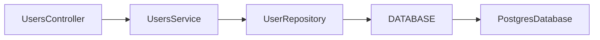

# Loutre Architecture Amendment — Source Compiler 廃止 / Runtime DI Graph

- 状態: **IMPLEMENTED**
- 対象: Loutre v0.1 architecture amendment
- 日付: 2026-08-24 JST
- 対象ブランチ: `develop`
- 目的: Source Compiler を廃止しつつ、Loutre の Application Graph / DI Graph を framework の第一級機能として維持・強化する
- Source of truth: 本文書で明示的に上書きされた項目については、既存 `architecture.md` より本文書を優先する

---

# 0. Executive Summary

Loutre v0.1 の DI / Graph 設計を以下へ変更する。

1. **TypeScript Source Compiler を Runtime correctness の必須要件から外し、最終的に廃止する。**
2. class dependency は次の API を標準とする。

```ts
class UsersService {
  constructor(readonly repository = inject(UserRepository)) {}
}
```

3. custom token も同じ `inject()` を使う。

```ts
class UserRepository {
  constructor(readonly db = inject(DATABASE)) {}
}
```

4. `@Injectable()`、`emitDecoratorMetadata`、`reflect-metadata`、class dependency 用 `@Inject()` は不要とする。
5. DI object graph construction は **同期処理** とする。
6. DB 接続などの非同期 resource initialization / cleanup は Lifecycle へ分離する。
7. Loutre は Application Graph を引き続き framework の第一級モデルとして扱う。
8. **Source Compiler 廃止の絶対条件として、`loutre graph di` から完全な DI dependency graph を生成できることを要求する。**
9. `loutre graph di` は request traffic などの「実際にたまたま実行された依存」を収集するのではなく、**Graph Probe によって全 framework-managed component を lifecycle 実行なしで construction し、`inject()` dependency edge を収集する。**
10. `loutre graph`, `loutre check`, `loutre explain`, `loutre doctor`, Runtime は可能な限り **同じ Application Graph / validation engine** を source of truth とする。
11. Compiler に存在していた Graph IR / semantic validation は捨てない。Compiler から独立した Graph layer へ移す。
12. Source Compiler / Runtime Linkage の削除は、本文書末尾の Acceptance Criteria をすべて満たした後にのみ実施する。

最重要原則:

> **Loutre の本体は Source Compiler ではなく Application Graph である。**

および:

> **Loutre は DI dependency graph の生成・検査・可視化を framework レベルで公式サポートする。**

---

# 1. 背景

従来の Loutre は、次のような constructor injection DX を実現するため TypeScript Source Compiler を利用していた。

```ts
const UsersController = implementation({
  name: 'UsersController',
  contract: UsersContract,
  protocol: http,
  factory: (users = inject(UsersService)) => ({
    get(ctx) {
      return ctx.response.ok({ body: users.get(ctx.params.id) })
    },
  }),
})
```

TypeScript の型情報は JavaScript runtime では消失するため、Source Compiler が TypeScript AST / TypeChecker を利用して、

```text
UsersController
    ↓
UsersService
```

という dependency edge を復元し、Runtime Linkage Artifact を生成していた。

しかし設計レビューの結果、Source Compiler が担当していた責務の多くは Source Compiler 固有ではないことが判明した。

- Contract は runtime descriptor と TypeScript 型で成立する
- Procedure は runtime descriptor
- Protocol は runtime descriptor
- Pipeline は runtime tuple
- Layer の `requires` / `provides` は runtime descriptor
- `ContextOf` は TypeScript の型演算で導出可能
- validation 前後の input type も TypeScript 型演算で導出可能
- Module は runtime descriptor
- Provider は runtime descriptor
- Implementationはdescriptorと同期factoryで成立する
- Capability requirement は Application Graph から算出可能
- Contract implementation coverage は Graph validation で検査可能
- Pipeline semantic validation は Graph validation で検査可能

Source Compiler を必須にする最大の理由は、実質的に、

```text
TypeScript 上にのみ存在する constructor parameter type
        ↓
Runtime DI token
```

の linkage であった。

この linkage を明示的な `inject()` に置き換えることで、Source Compiler を Runtime correctness の必須要件から外せる。

---

# 2. Architecture Principle の変更

## 2.1 旧理解

従来は Loutre を内部的にも以下のように捉える傾向があった。

```text
Compiler-first
      ↓
Application Graph
      ↓
Runtime
```

## 2.2 新理解

今後は次を source of truth とする。

```text
                 Loutre

             Application Graph
                    │
        ┌───────────┼───────────┐
        │           │           │
        ▼           ▼           ▼
 Type System      Runtime       Tooling
                                  │
                                  ├ graph
                                  ├ check
                                  ├ explain
                                  └ doctor
```

Compiler は Application Graph の成立要件ではない。

より短く表現すると:

> **Graph-first, type-safe runtime.**

マーケティング上 `Compiler-first` という表現を残すかどうかは別途判断してよいが、architecture decision において Compiler を最上位概念として扱ってはならない。

判断基準は常に:

> **この情報は Application Graph として必要か？**

である。

---

# 3. 新 DI Public API

## 3.1 class dependency

標準形:

```ts
import { inject } from '@loutrejs/loutre'

class UserRepository {}

class UsersService {
  constructor(readonly repository = inject(UserRepository)) {}
}
```

class token に decorator は不要。

禁止・不要:

```ts
@Injectable()
class UsersService {}
```

```ts
constructor(
  @Inject(UserRepository)
  readonly repository: UserRepository,
) {}
```

```json
{
  "compilerOptions": {
    "emitDecoratorMetadata": true
  }
}
```

## 3.2 custom token

```ts
const DATABASE = token<Database>('database')

class UserRepository {
  constructor(readonly db = inject(DATABASE)) {}
}
```

class / custom token の利用方法を `inject()` で統一する。

## 3.3 推奨は field injection ではなく constructor default parameter

非推奨:

```ts
class UsersService {
  private readonly repository = inject(UserRepository)
}
```

推奨:

```ts
class UsersService {
  constructor(readonly repository = inject(UserRepository)) {}
}
```

理由:

- Production では Container が default parameter を利用できる
- Unit Test では普通の constructor argument として override できる
- Test Container を要求しない
- dependency が constructor signature に残る
- class の dependency が読みやすい

例:

```ts
const service = new UsersService(mockRepository)
```

この場合 `inject(UserRepository)` は評価されない。

---

# 4. `inject()` の意味論

`inject()` は Service Locator API ではない。

Loutre では次の3責務を持つ。

```text
inject(TOKEN)
    │
    ├ dependency declaration
    ├ dependency resolution
    └ dependency graph instrumentation
```

## 4.1 利用可能範囲

`inject()` は **framework-managed componentの同期construction中のみ**利用可能。

許可:

```ts
class UsersService {
  constructor(readonly repository = inject(UserRepository)) {}
}
```

原則禁止:

```ts
class UsersService {
  run() {
    const repository = inject(UserRepository)
  }
}
```

エラー例:

```text
LUTRE_DI_CONTEXT
inject(UserRepository) was called outside a Loutre injection context.
```

## 4.2 Execution data には使わない

以下は DI ではない。

- request
- session
- current user
- current tenant
- permissions
- protocol-specific execution state

これらは引き続き `ctx` に置く。

```text
Application dependency
        ↓
     inject()

Execution-scoped data
        ↓
       ctx
```

これは既存の Phase 1 decision を維持する。

---

# 5. Injection Context

DI construction は同期処理とするため、Node.js `AsyncLocalStorage` 等を要求しない。

概念実装:

```ts
interface InjectionContext {
  readonly container: Container
  readonly consumer: TokenLike
}

let currentInjectionContext: InjectionContext | undefined

function runInInjectionContext<T>(
  context: InjectionContext,
  run: () => T,
): T {
  const previous = currentInjectionContext
  currentInjectionContext = context

  try {
    return run()
  } finally {
    currentInjectionContext = previous
  }
}

export function inject<TToken extends TokenLike>(
  token: TToken,
): TokenValue<TToken> {
  if (!currentInjectionContext) {
    throw new InjectionContextError(...)
  }

  return currentInjectionContext.container.resolve(token)
}
```

Container:

```ts
instantiate(Target) {
  return runInInjectionContext(
    { container: this, consumer: Target },
    () => new Target(),
  )
}
```

`inject()` 呼び出し時に、

```text
consumer → dependency
```

edge を Dependency Recorder に記録する。

---

# 6. DI Resolution は同期

## 6.1 Object Graph Construction

次は同期で完了しなければならない。

- `Container.resolve()`
- class constructor
- `inject()`
- synchronous factory provider
- conditional provider selection
- cheap synchronous object initialization

将来 API 名として `resolveSync` を露出させる必要はない。Public API としては単に `resolve()` を同期関数へ変更してよい。

## 6.2 Async resource initialization は Lifecycle

DB / Redis / Kafka / socket / filesystem watcher 等は constructor / factory で接続開始してはならない。

推奨:

```ts
class Database implements OnModuleInit, OnModuleDestroy {
  constructor(readonly config = inject(DB_CONFIG)) {}

  private pool!: Pool

  async onModuleInit() {
    this.pool = await connect(this.config.url)
  }

  async onModuleDestroy() {
    await this.pool.close()
  }
}
```

責務分離:

```text
Construction Phase
──────────────────
- synchronous
- dependency wiring
- Graph construction
- no resource acquisition

Lifecycle Phase
───────────────
- asynchronous allowed
- I/O allowed
- DB connect
- socket connect
- schema verification
- resource cleanup
```

---

# 7. Factory Provider

既存 Public API の `useFactory` は同期返却を基本とする。

```ts
provide(CONFIG).useFactory({
  inject: [ENV],
  use: (env) => ({
    endpoint: env.API_URL,
  }),
})
```

禁止:

```ts
provide(DATABASE).useFactory({
  use: async () => connectDatabase(),
})
```

Runtime は thenable が返された場合に fail-fast してよい。

例:

```text
LUTRE_DI_ASYNC_FACTORY
Async factory providers are not supported.
Move asynchronous resource initialization to application lifecycle.
```

Factory の dependency は `inject: []` が source of truth。

Factory body 内の `inject()` は原則禁止する。

理由:

- dependency が declaration から消える
- Graph Probe の挙動が複雑になる
- 既存 `inject: []` と責務が重複する

---

# 8. Provider Scope

Phase 1 の scope は維持する。

```ts
type Scope = 'application' | 'transient'
```

## 8.1 application

token ごとに1 instance。

```text
A ─┐
   ├─> SharedService
B ─┘
```

## 8.2 transient

resolve / injection ごとに新 instance。

ただし application-scoped consumer に一度 injection された transient は、その consumer が保持するため結果として同じ instance を使い続ける。

これは正常な意味論。

## 8.3 Lifecycle と transient

Phase 1 では:

> **Lifecycle guarantee を持つのは application-scoped managed instance のみ。**

transient instance に、

- `onModuleInit`
- `onApplicationBootstrap`
- `onModuleDestroy`
- `beforeApplicationShutdown`
- `onApplicationShutdown`

の実行保証を与えない。

resource lifecycle が必要な object は application scope に置く。

---

# 9. Managed Component

暗黙の arbitrary class auto-resolution は廃止する方向とする。

framework-managed component は次のいずれか。

1. Module `providers` に明示された class
2. `provide(TOKEN).useClass(Class)` の implementation
3. Module `implementations` に明示されたImplementation descriptor
4. conditional provider mapping に明示された class
5. framework built-in として明示登録された class

例:

```ts
defineModule(() => ({
  providers: [UserRepository, UsersService],
}))
```

Implementationは次のようにModuleへ所属させる。

```ts
defineModule(() => ({
  implementations: [UsersController],
}))
```

だけが managed。

次のような undeclared class dependency はエラー。

```ts
class UsersService {
  constructor(readonly repository = inject(UserRepository)) {}
}

// UserRepository が providers にない
```

```text
LUTRE_DI_UNRESOLVED
UsersService requires UserRepository,
but no provider is declared for UserRepository.
```

これは Explicit Application Graph の原則に合致する。

---

# 10. Circular Dependency

DI cycle は design error として拒否する。

```ts
class A {
  constructor(readonly b = inject(B)) {}
}

class B {
  constructor(readonly a = inject(A)) {}
}
```

Graph:

```text
A
└─ B
   └─ A  ↺
```

Diagnostic:

```text
LUTRE_DI_CYCLE
A -> B -> A
```

Phase 1 では `forwardRef()` 等の cycle workaround を提供しない。

---

# 11. Application Graph の再定義

Source Compiler 廃止後も Application Graph を弱めてはならない。

Application Graph は最低限次を含む。

```text
Application Graph
├ Module graph
├ Provider graph
├ DI dependency graph
├ Contract graph
├ Procedure graph
├ Protocol binding
├ Pipeline graph
├ Context requires/provides
├ validation state
├ Implementation descriptor
├ Lifecycle metadata
├ Env / conditional branch
├ Runtime capability requirements
└ diagnostics
```

## 11.1 Declared Graph と Probed Dependency

DI edge は取得方法を区別してよい。

```ts
type DependencyEdgeSource = 'declared' | 'probed'
```

`declared`:

- factory `inject: []`
- lifecycle hook `inject: []`
- conditional mapping
- explicit Provider declaration
- framework-defined dependency

`probed`:

- managed componentの同期construction中に `inject()` から取得した dependency edge

「probed」は request traffic で観測されたという意味ではない。

**Graph Probe によって意図的に全 managed component を construction して取得された dependency** を意味する。

---

# 12. Dependency Edge IR

DI dependency を Provider 内部フィールドだけで表現せず、first-class edge として扱うことを推奨する。

例:

```ts
interface DependencyEdgeIR {
  readonly from: string
  readonly to: string

  readonly kind:
    'inject' | 'factory' | 'lifecycle' | 'conditional' | 'framework'

  readonly source: 'declared' | 'probed'

  readonly condition?: {
    readonly key: string
    readonly equals: PropertyKey
  }
}
```

Node は最低限:

```ts
interface DependencyNodeIR {
  readonly id: string
  readonly label: string

  readonly kind:
    | 'class'
    | 'token'
    | 'factory'
    | 'conditional'
    | 'implementation'
    | 'framework'

  readonly scope?: 'application' | 'transient'
  readonly module?: string
}
```

---

# 13. Graph Engine

Source Compiler の代わりに framework-level Graph Engine を持つ。

推奨 package 構成:

```text
@loutrejs/loutre
├ Contract
├ Module
├ Provider
├ Token
├ inject()
├ Pipeline
├ Layer
└ ContextKey

@loutrejs/loutre/graph
├ ApplicationGraphIR
├ GraphBuilder
├ GraphProbe
├ DependencyRecorder
├ validateGraph()
├ graph serialization
└ graph diagnostics

@loutrejs/loutre/runtime
├ Container
├ InjectionContext
├ lifecycle
├ pipeline execution
└ application runtime

@loutrejs/cli
├ graph
├ check
├ doctor
├ explain
├ dev
├ start
└ build
```

package 名 `@loutrejs/loutre/graph` は推奨案。必須ではない。

重要なのは責務分離。

---

# 14. Graph Builder

Graph Builder は application の runtime descriptors から Declared Graph を生成する。

対象:

- root Module
- imported Module
- providers
- exports
- requires
- Contract
- Procedure
- Protocol
- Pipeline
- Layer
- Implementation
- factory inject
- lifecycle inject
- conditional mapping
- capabilities

Source AST を読まない。

---

# 15. Graph Probe

## 15.1 目的

`inject()` dependency を Source Compiler なしで取得する。

## 15.2 基本動作

```text
Application entry load
       ↓
Graph Builder
       ↓
Declared Graph
       ↓
Graph Probe Container
       ↓
全 managed component を construction
       ↓
inject() edge を record
       ↓
DI Graph merge
       ↓
validateGraph()
       ↓
Complete Application Graph
```

## 15.3 Probe 対象

必須:

- application-scoped class provider
- transient class provider
- Implementation descriptorの同期factory
- `useClass` implementation
- conditional mapping の **全 candidate**
- framework-managed built-ins

Factory provider は body を dependency discovery のために実行する必要はない。`inject: []` から edge を取得する。

Lifecycle hook も `inject: []` から取得する。

## 15.4 Conditional Provider

実行時に選択されていない branch も graph 対象。

例:

```ts
provide(STORAGE).select(Env.key('STORAGE_DRIVER'), {
  memory: MemoryStorage,
  s3: S3Storage,
})
```

Graph:

```text
STORAGE
├─ [STORAGE_DRIVER=memory]
│  └─ MemoryStorage
└─ [STORAGE_DRIVER=s3]
   └─ S3Storage
```

さらに各 candidate class を Probe して dependency を取得する。

これにより development で未選択だった production branch の broken DI も検出できる。

---

# 16. Graph Probe と Side Effect

`loutre graph` が安全に利用できるため、managed component construction に明確な purity rule を設ける。

## 16.1 Graph command で実行してよいもの

```text
OK
- application module evaluation
- defineModule evaluation
- synchronous provider declaration
- managed Provider class constructor
- Layer / Implementation factory
- default parameter
- inject()
- cheap synchronous initialization
```

## 16.2 Graph command で実行してはならないもの

```text
NG
- onModuleInit
- onApplicationBootstrap
- server listen
- MessagePort listener registration
- DB connection
- Redis connection
- Kafka connection
- socket connection
- filesystem watcher
- long-running timer
```

## 16.3 Constructor Safety

Framework managed constructor は:

> dependency wiring と cheap synchronous initialization のみに限定する。

外部 resource acquisition は Lifecycle に移す。

この制約は `loutre graph` を成立させるためだけでなく、application lifecycle の責務分離として正式な設計原則とする。

---

# 17. `loutre graph` は正式な Framework Capability

DI Graph 生成は debug helper ではない。

Loutre の正式な product capability とする。

最低限、既存 UX を維持する。

```sh
loutre graph modules
loutre graph di
loutre graph contracts
loutre graph runtime
```

format:

```sh
--format text
--format json
--format mermaid
```

---

# 18. `loutre graph di`

例:

```sh
loutre graph di --entry src/app.ts
```

Text output 例:

```text
UsersController [implementation, application]
└── UsersService [application]
    └── UserRepository [application]
        └── DATABASE [token]
            └── PostgresDatabase [application]
```

transient:

```text
UsersService [application]
└── RequestSigner [transient]
```

Conditional:

```text
STORAGE [token]
├── [STORAGE_DRIVER=memory] MemoryStorage [application]
└── [STORAGE_DRIVER=s3] S3Storage [application]
    └── S3Client [application]
```

## 18.1 Broken Graph も表示する

unresolved dependency があっても、可能な限り partial graph を表示する。

```text
UsersService
└── UserRepository  ✗ UNRESOLVED
```

その後 exit code `1`。

これにより diagnostic の原因が視覚的に分かる。

## 18.2 Cycle

```text
A
└── B
    └── C
        └── A  ↺ cycle
```

その後:

```text
LUTRE_DI_CYCLE
A -> B -> C -> A
```

---

# 19. JSON Graph Format

`--format json` は machine-readable な正式 interface として設計する。

例:

```json
{
  "version": 1,
  "nodes": [
    {
      "id": "class:UsersService",
      "label": "UsersService",
      "kind": "class",
      "scope": "application",
      "module": "UsersModule"
    }
  ],
  "edges": [
    {
      "from": "class:UsersController",
      "to": "class:UsersService",
      "kind": "inject",
      "source": "probed"
    }
  ],
  "diagnostics": []
}
```

Graph JSON schema は将来 CI / IDE / visualizer が利用することを想定し、version field を必須とする。

---

# 20. Mermaid Output

公式のdiagram出力形式:

```sh
loutre graph di --format mermaid
```

README / GitHub / docsへ直接貼れるMermaid flowchartを出力する。

Token / Scope / Conditional 等を node label / edge label へ含めること。

例:



---

# 21. DOT Output

`--format dot`は提供しない。diagram出力はMermaidへ統一する。

---

# 22. `loutre check`

Source Compiler 廃止後:

```text
load application
      ↓
build declared graph
      ↓
run graph probe
      ↓
merge DI edges
      ↓
validateGraph()
      ↓
diagnostics
```

Lifecycle は実行しない。

`check` と `graph` で別 validation implementation を持たない。

---

# 23. `loutre explain`

既存 `explain` の機能を新 Application Graph へ接続する。

例:

```sh
loutre explain UsersController
```

```text
UsersController

kind:
  implementation

managed by:
  UsersContract
  protocol: http

scope:
  application

dependencies:
  UsersService
    source: inject
    scope: application
    provided by: UsersModule

    UserRepository
      source: inject
      scope: application
      provided by: UsersModule

      DATABASE
        source: inject
        provider: PostgresDatabase
```

Pipeline explain も同じ Graph を source of truth にする。

---

# 24. `loutre doctor`

Runtime capability requirement は Source Compiler からではなく Application Graph から取得する。

```sh
loutre doctor cloudflare-workers --entry src/app.ts
```

```text
Runtime: cloudflare-workers

Required:
  http.server
  crypto.random

Missing:
  (none)
```

DI Graph Probe は target runtime の server を開始してはならない。

CLI を Node 上で実行しつつ workerd / Bun / Deno / Lambda / Electron target の capability 検査が可能であること。

---

# 25. Runtime と Graph の Source of Truth

絶対に次のようにしない。

```text
runtime validation
graph validation
check validation
source validation
```

それぞれ別実装。

目標:

```text
                    Application
                        │
                        ▼
                  Graph Builder
                        │
             ┌──────────┴──────────┐
             │                     │
             ▼                     ▼
      Declared Graph           Graph Probe
                                     │
                                     ▼
                              Probed DI Edges
             │                     │
             └──────────┬──────────┘
                        ▼
               ApplicationGraph
                        │
                        ▼
                  validateGraph()
                 /      |       \
                /       |        \
               ▼        ▼         ▼
            Runtime   check      graph
                                / |  \
                          text json mermaid
```

Graph semantic validation は **1実装のみ**。

---

# 26. Graph Validation

最低限次を共通 validator で検出する。

## Modules

- duplicate provider
- invalid import/export
- invalid module requirements

## Implementations

- missing implementation
- duplicate implementation
- protocol mismatch
- missing procedure implementation

## Pipeline

- terminal count != 1
- terminal is not last
- wrong protocol terminal
- unmet `requires`
- duplicate implicit context overwrite
- validation required before Layer
- invalid short circuit variant
- invalid short circuit response status

## DI

- unresolved token
- undeclared class dependency
- duplicate provider
- cycle
- invalid conditional mapping
- invalid scope relationship if future rules require it
- async factory return

## Runtime

- missing capability

---

# 27. Lifecycle Ordering

今回の Source Compiler 廃止で必須変更にはしない。

現行 lifecycle ordering を維持してよい。

ただし Graph Probe によって DI dependency DAG を取得できるため、将来的には:

```text
dependency-first initialization
reverse-dependency destruction
```

を検討できる。

例:

```text
A -> B -> C
```

Init:

```text
C
B
A
```

Destroy:

```text
A
B
C
```

これは別 architecture amendment とする。

---

# 28. Source Compiler 廃止によって失うもの

明示的に認識する。

## 失う

- source code を実行せずに class DI dependency を完全取得する能力
- TypeScript AST からの constructor type inference
- type-only import から runtime DI token を復元する機能
- source position を AST から直接得る一部 diagnostic
- TypeScript source 全体から framework metadata を復元する機能

## 維持・強化する

- Application Graph
- Contract / Protocol / Pipeline model
- typed Context
- runtime portability
- DI relation graph
- `loutre graph`
- `loutre check`
- `loutre explain`
- capability diagnostics
- cycle detection
- unresolved dependency detection
- conditional branch validation

---

# 29. Source Compiler 廃止によって得るもの

- TypeScript compiler unstable API 依存の削減
- TypeScript version coupling の大幅削減
- Source AST visitor maintenance の削減
- symbol resolution maintenance の削減
- incremental compiler session の削減
- Runtime Linkage Artifact の削減
- dev/start/build path の単純化
- Node-only build infrastructure と runtime architecture の分離
- Bun / Deno / workerd 等での runtime portability の改善
- framework implementation complexity の削減
- DI Public API の明示化
- Compiler と Runtime の validation 二重実装の廃止

---

# 30. 現在の Compiler Package の扱い

現行 `packages/compiler/src` には少なくとも:

```text
compiler.ts
index.ts
ir.ts
runtime-linkage.ts
runtime.ts
source-compiler.ts
source-validation.ts
```

が存在する。

現行 `@loutrejs/compiler` は TypeScript package へ直接依存している。

移行後:

## 移動候補

```text
packages/compiler/src/ir.ts
```

Graph IR として必要な部分を:

```text
packages/graph/src/ir.ts
```

等へ移動。

```text
packages/compiler/src/compiler.ts
```

のうち Source Compiler 非依存の:

- Module traversal
- Contract / Pipeline graph construction
- semantic graph validation

を:

```text
@loutrejs/loutre/graph
```

へ移動・再構成する。

## 削除候補

新 Graph Engine parity 達成後:

```text
packages/compiler/src/source-compiler.ts
packages/compiler/src/source-validation.ts
packages/compiler/src/runtime-linkage.ts
packages/compiler/src/runtime.ts
```

削除。

`packages/compiler/src/index.ts` も package 自体を廃止するなら削除。

## Package

最終的に:

```text
packages/compiler/
```

全体を削除可能にすることを目標とする。

ただし Graph Engine が完成する前には削除しない。

---

# 31. Runtime Linkage 廃止

現行 Runtime には Compiler が生成した Runtime Linkage Artifact を attach する仕組みがある。

新 DI では不要。

削除対象候補:

```text
packages/runtime/src/linkage.ts
packages/runtime/src/internal.ts
```

および:

```text
Container[runtimeLinkageTarget](...)
ApplicationRuntime[runtimeLinkageTarget](...)
```

Source Compiler parity 確認後に削除。

Container は `inject()` + Injection Context で dependency を runtime resolution する。

---

# 32. `Inject` Decorator

現行:

```ts
@Inject(TOKEN)
constructor(...)
```

は新 DI では不要。

新:

```ts
constructor(
  readonly value = inject(TOKEN),
) {}
```

migration 後は `Inject` decorator API を削除する。

移行期間に deprecated alias を残すかは実装時に判断可能だが、v0.1 public API が未安定であるなら一気に削除してよい。

最終目標:

```text
Inject decorator
experimentalDecorators
emitDecoratorMetadata
reflect-metadata
```

のいずれにも依存しない。

---

# 33. Build Command

Source Compiler / Runtime Linkage 廃止後、`loutre build` は TypeScript source rewrite / linkage bootstrap を生成しない。

責務候補:

```text
loutre build
  ├ validate application graph
  ├ produce graph manifest
  ├ verify runtime capabilities
  └ delegate ordinary TS/bundler build
```

Loutre が bundler になる必要はない。

Graph Manifest 出力は引き続き価値がある。

例:

```text
dist/loutre/loutre.manifest.json
```

manifest は Graph Engine の ApplicationGraph を serialize して生成する。

---

# 34. `dev` / `start`

Source Compiler linkage を挟まず application entry を load する。

```text
loutre dev src/app.ts
       ↓
load application
       ↓
build / validate graph
       ↓
graph probe
       ↓
runtime initialize
       ↓
listen
```

`graph probe` と通常 runtime resolution の結果を共有するか、別 container とするかは実装詳細。

重要:

- runtime correctness に Source Compiler が不要
- no linked application artifact
- no transformed source
- no generated constructor dependency array

---

# 35. Migration Strategy

Source Compiler を先に消してはならない。

以下の順番を守る。

## Phase A — `inject()` foundation

実装:

- `inject(token)`
- Injection Context
- synchronous Container resolution
- class/custom token support
- application/transient support
- cycle detection
- managed component declaration enforcement

まだ Source Compiler は削除しない。

既存テストとの parallel support を許可。

## Phase B — Constructor Migration

全 fixture / example / test を:

```ts
constructor(service: Service)
```

から:

```ts
constructor((service = inject(Service)))
```

へ移行。

custom token:

```ts
@Inject(TOKEN)
```

から:

```ts
inject(TOKEN)
```

へ移行。

## Phase C — Dependency Recorder

`inject()` ごとに:

```text
consumer -> dependency
```

を記録できるようにする。

Graph representation を追加。

## Phase D — Graph Probe

全 framework-managed component を lifecycle なしで Probe する。

必須:

- class providers
- transient providers
- implementations
- `useClass`
- conditional all branches

broken dependency / cycle の partial graph も返す。

## Phase E — Graph Engine Unification

Graph IR / validation を compiler package から独立。

- `GraphBuilder`
- `GraphProbe`
- `validateGraph()`

を source of truth にする。

`compileApplication()` に存在する useful graph logic は再利用・移動する。

## Phase F — CLI Migration

以下を新 Graph Engine へ接続:

```text
loutre graph
loutre check
loutre explain
loutre doctor
```

`text/json/mermaid` parity を満たす。

## Phase G — Runtime Migration

Runtime から Runtime Linkage Artifact dependency を削除。

Source Compiler を通さず:

```text
dev
start
test
```

が動作すること。

## Phase H — Build Migration

`loutre build` から TypeScript source transform / Runtime Linkage generation を削除。

Graph Manifest は新 Graph Engine から生成。

## Phase I — Compiler Removal

Acceptance Criteria がすべて green になった後:

```text
source-compiler.ts
source-validation.ts
runtime-linkage.ts
compiler package dependency
typescript compiler dependency
```

を削除。

最後に `packages/compiler` package 自体の削除を検討・実行。

---

# 36. Compatibility / Runtime Matrix

新 `inject()` / Graph Probe は Web API や Node-only API に依存してはならない。

DI runtime core で使ってよい primitives:

```text
Map
Set
WeakMap
try/finally
class
function
Symbol
Promise は Lifecycle のみ
```

最低対象:

```text
Node
Bun
Deno
Cloudflare Workers
AWS Lambda
Electron
```

既存 runtime conformance gate をすべて維持する。

---

# 37. Testing Requirements

最低限追加するテスト。

## inject()

- class token resolve
- custom token resolve
- inject outside construction rejects
- nested injection restores context
- exception 時も Injection Context が restore される

## scope

- application singleton
- transient per injection
- transient injected into application consumer
- Implementation descriptor単位のfactory result cache semantics

## factory

- sync factory
- factory `inject: []`
- async/thenable factory rejects
- factory dependency graph

## conditional

- selected runtime branch resolve
- Graph Probe は全 branch を探索
- unselected broken branch も graph/check が検出

## lifecycle

- Probe では lifecycle が一切走らない
- Runtime initialize では lifecycle が走る
- transient lifecycle を保証しない

## testing DX

```ts
new UsersService(mockRepo)
```

で Container なしの unit test が成立。

## graph

- `inject()` edge が出る
- custom token edge が出る
- Provider edge が出る
- scope が出る
- factory edge
- lifecycle edge
- conditional edge
- cycle
- unresolved
- partial graph

## CLI

- `graph di --format text`
- `graph di --format json`
- `graph di --format mermaid`
- `graph modules`
- `graph contracts`
- `graph runtime`
- `check`
- `explain`
- `doctor`

## No Compiler

- `@loutrejs/compiler` を import せず runtime tests pass
- Runtime Linkage Artifact なしで all runtime conformance pass
- TypeScript compiler package を runtime dependency として不要化

---

# 38. Source Compiler 廃止 Acceptance Criteria

**以下を1つでも満たさない場合、Source Compiler を削除してはならない。**

- [x] `constructor(x = inject(Class))` が class dependency で動作する
- [x] `constructor(x = inject(TOKEN))` が custom token で動作する
- [x] `@Injectable()` 不要
- [x] `@Inject()` 不要
- [x] `emitDecoratorMetadata` 不要
- [x] `reflect-metadata` 不要
- [x] DI construction が同期
- [x] async resource initialization が Lifecycle で表現可能
- [x] application scope が正しく動く
- [x] transient scope が正しく動く
- [x] factory provider が正しく動く
- [x] conditional provider が正しく動く
- [x] conditional **全 branch** を Graph Probe できる
- [x] circular dependency を検出できる
- [x] unresolved dependency を検出できる
- [x] undeclared arbitrary class auto-resolution を拒否できる
- [x] Controller / implementation dependency を取得できる
- [x] Module provider dependency を取得できる
- [x] factory dependency を取得できる
- [x] lifecycle hook dependency を取得できる
- [x] `loutre graph di` が動く
- [x] `loutre graph di --format text` が動く
- [x] `loutre graph di --format json` が動く
- [x] `loutre graph di --format mermaid` が動く
- [x] Graph に scope が表示される
- [x] Graph に custom token が表示される
- [x] Graph に conditional edge が表示される
- [x] broken graph でも partial graph + diagnostic を返せる
- [x] `loutre graph` 実行時に lifecycle が走らない
- [x] `loutre check` が同じ Application Graph を使う
- [x] `loutre explain` が同じ Application Graph を使う
- [x] `loutre doctor` が同じ Application Graph を使う
- [x] Graph semantic validation が1実装に統一されている
- [x] `dev` が Runtime Linkage Artifact なしで動く
- [x] `start` が Runtime Linkage Artifact なしで動く
- [x] `build` が Source Compiler linkage なしで成立する
- [x] Node conformance pass
- [x] Bun conformance pass
- [x] Deno conformance pass
- [x] Cloudflare Workers conformance pass
- [x] Lambda conformance pass
- [x] Electron conformance pass
- [x] Source Compiler を無効化した状態ですべての relevant test が pass

すべて完了した時点で初めて:

```text
packages/compiler/src/source-compiler.ts
packages/compiler/src/source-validation.ts
packages/compiler/src/runtime-linkage.ts
```

等を削除する。

---

# 39. Codex 実装時の禁止事項

- Source Compiler を先に削除しない
- CLI graph parity を失った状態を中間完成としない
- `inject()` を request-scoped Service Locator として利用可能にしない
- constructor で async I/O を行う設計へ誘導しない
- Graph Probe で lifecycle を実行しない
- conditional provider の現在選択中 branch だけを Graph 対象にしない
- runtime/check/graph で別々の semantic validator を実装しない
- `emitDecoratorMetadata` に戻さない
- `reflect-metadata` を導入しない
- class dependency のための `@Injectable()` を要求しない
- `inject()` の dependency edge を Graph から捨てない
- arbitrary undeclared class auto-resolution を新設しない
- filesystem discovery を導入しない

---

# 40. Definition of Done

この amendment の実装は、単に DI が動く状態では完了しない。

以下が成立した状態を Done とする。

```text
class UsersService {
  constructor(
    readonly repo = inject(UserRepository),
  ) {}
}
```

が Compiler なしで動き、

```sh
loutre graph di --entry src/app.ts
```

から:

```text
UsersService
└── UserRepository
```

を framework 自身が生成でき、

```sh
loutre check --entry src/app.ts
```

が同じ Graph を検査し、

```sh
loutre explain UsersService --entry src/app.ts
```

が同じ dependency edge を説明でき、

同時に Node / Bun / Deno / Cloudflare Workers / AWS Lambda / Electron runtime conformance が維持されていること。

---

# 41. Final Architecture Statement

本 amendment 後の Loutre は:

> **明示的な Application Graph を中心に、Contract、Protocol、Pipeline、DI、Lifecycle、Runtime Capability を統一的に扱う TypeScript Application Framework。**

DI の dependency declaration は:

```ts
inject(Token)
```

として普通の TypeScript code 内に明示する。

Compiler は Application Graph の成立条件ではない。

Framework は runtime descriptors と Graph Probe から Application Graph を生成し、Developer が:

```text
見る
検査する
説明する
CI で利用する
可視化する
```

ことを公式にサポートする。

最終的な設計原則:

> **Loutre treats application dependencies as a first-class graph.**

> **Application Graph を消したら Loutre ではなくなる。Source Compiler を消しても Loutre は残る。**

---

# 42. Next Implementation Order

Codex は次の順序で作業すること。

1. `inject()` + Injection Context の vertical slice
2. Container synchronous resolution
3. existing DI tests を新 API へ移行
4. dependency recorder
5. Graph Probe
6. conditional all-branch probing
7. DI Graph IR
8. `loutre graph di` を新 Graph へ接続
9. text/json/mermaid parity
10. `check` / `explain` / `doctor` を同じ Graph へ接続
11. Graph validation 一本化
12. Runtime Linkage を無効化した runtime conformance
13. `dev` / `start` の Source Compiler removal
14. `build` の Graph Manifest 移行
15. Acceptance Criteria 全項目確認
16. Source Compiler / Runtime Linkage 削除
17. `@loutrejs/compiler` package 削除可否確認
18. README / architecture.md を新 Graph-first 設計へ更新

**Compiler の削除 commit は必ず最後にすること。**

---

# 43. Notes for Existing Repository

2026-08-24 `develop` 時点で確認されている関連箇所:

```text
packages/core/src/provider.ts
packages/core/src/token.ts
packages/core/src/lifecycle.ts

packages/runtime/src/application.ts
packages/runtime/src/di.ts
packages/runtime/src/linkage.ts
packages/runtime/src/internal.ts

packages/compiler/src/compiler.ts
packages/compiler/src/ir.ts
packages/compiler/src/runtime-linkage.ts
packages/compiler/src/source-compiler.ts
packages/compiler/src/source-validation.ts

packages/cli/src/index.ts
packages/cli/src/linked-application.ts

tests/di.test.ts

integrations/database-modules/src/index.ts
integrations/http-auth/src/index.ts
integrations/http-crud/src/index.ts
```

CLI には現在すでに:

```text
loutre graph modules
loutre graph di
loutre graph contracts
loutre graph runtime

--format text
--format json
--format mermaid
```

が存在する。

**これらの UX は Source Compiler 廃止によって後退させてはならない。**

特に `loutre graph di` の parity + 強化が Source Compiler 廃止の gate である。
