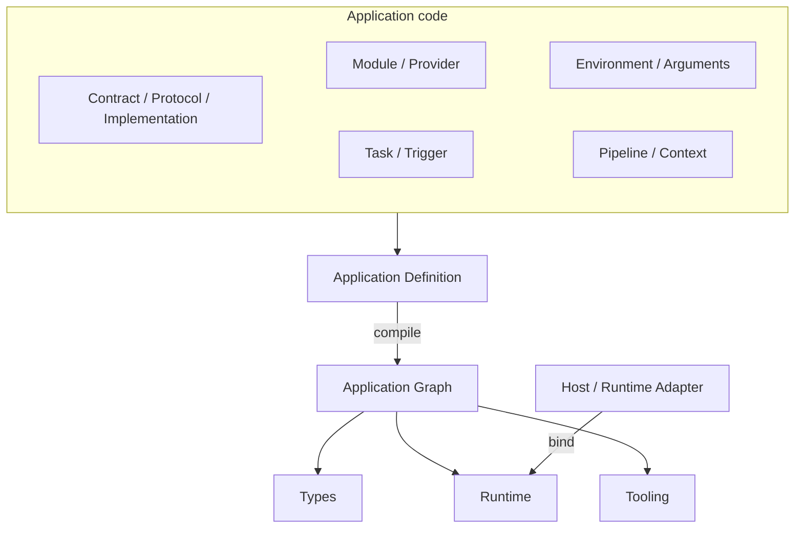

# Loutre Architecture

LoutreのApplicationは、特定のRuntimeに依存しない**Application Definition**として定義します。

Definitionから生成される**Application Graph**には、Module、Provider、Protocol、Taskなど、Applicationを構成する情報が集約されます。LoutreのType System、Runtime、CLIは、この同じGraphをもとに動作します。

このページでは、LoutreのApplicationがどのように構成され、Graphになり、Runtime上で実行されるのかを順番に見ていきます。

最初のApplicationを作る場合は[Getting Started](./getting-started.md)から始めてください。

## Overview



Loutreでは、Applicationの構造と実行方法を分けて考えます。

Application codeはRuntimeに依存しないDefinitionとして記述し、Node.js、Bun、Deno、Cloudflare Workersなどへの接続はHostやRuntime Adapterが担当します。

その間にあるのがApplication Graphです。

Graphには、Applicationを構成するModuleやProviderだけでなく、Protocol、Task、Trigger、Pipeline、Runtime Capabilityなども含まれます。

この構成にはいくつかの基本ルールがあります。

- Applicationは一つのportableなDefinitionとして宣言する
- Protocol procedure、public Task、TriggerをExecution RootとしてGraphへ登録する
- Applicationが所有するresourceはDIで管理する
- requestやmessageごとのdataはtyped Contextで渡す
- listener、process、deploymentなどRuntime固有の処理はApplication codeから分離する
- 利用できない機能は、可能な限りTypeScriptのAPIにも公開しない
- Graph constructionは同期的かつ副作用なしで完了させる

Type System、Runtime、Toolingが同じGraphを共有することで、それぞれがApplicationの構造を別々に解釈する必要がありません。

## Packages

Loutreは役割ごとにpackageを分けています。

| Package            | Role                                             |
| ------------------ | ------------------------------------------------ |
| `@loutrejs/loutre` | Application Definition、Graph、Runtime、Protocol |
| `@loutrejs/node`   | Node.js Runtime Adapter                          |
| `@loutrejs/bullmq` | BullMQ Queue Consumer Driver                     |
| `@loutrejs/cli`    | Graph inspection、build、OpenAPI生成             |
| `create-loutre`    | Application starter生成                          |

Core packageの`@loutrejs/loutre`は、用途ごとにsubpathを公開します。

| Subpath                         | Role                                    |
| ------------------------------- | --------------------------------------- |
| `@loutrejs/loutre`              | Core、Module、DI、Task、Trigger         |
| `@loutrejs/loutre/host`         | Runtime-neutralな`bootstrap()`          |
| `@loutrejs/loutre/binding`      | Host、invocation、resource binding      |
| `@loutrejs/loutre/graph`        | Application Graphとdiagnostics          |
| `@loutrejs/loutre/runtime`      | Runtime、Lifecycle、Capability metadata |
| `@loutrejs/loutre/http`         | HTTP Protocol、Layer、Client            |
| `@loutrejs/loutre/message-port` | MessagePort Protocol                    |
| `@loutrejs/loutre/openapi`      | OpenAPI 3.2生成                         |
| `@loutrejs/loutre/presentation` | 起動時presentation                      |
| `@loutrejs/loutre/runtime/*`    | RuntimeごとのAdapter                    |

Application Graphは通常のJavaScript / TypeScriptとして組み立てられます。

Graphを生成するためだけのcompiler packageや、TypeScript compiler API、decorator metadata、`reflect-metadata`は必要ありません。

## Application Definition

`defineApplication()`はApplication全体の構成を定義します。

```text
Application Definition
├ modules[]
├ arguments?
├ tasks[]
├ triggers[]
└ logger?
```

Definitionが表すのは、**Applicationが何で構成されているか**です。

`init()`、`run()`、`fetch()`、`listen()`、`close()`のような実行APIは持ちません。また、Definitionをimportしただけでlistenerやtimerが開始されることもありません。

```ts
const application = defineApplication({
  modules: [UsersModule],
});
```

実際にApplicationを起動するのはHostやRuntime Adapterです。

この分離によって、同じDefinitionをRuntime executionだけでなく、Graph inspection、テスト、OpenAPI生成、deployment toolingからも利用できます。

## Contract, Protocol, and Implementation

外部とのinteractionは、Contract、Protocol、Implementationの3つを中心に構成します。

### Contract

ContractはProcedureの集合です。

それぞれのProcedureには、入力、response、Pipeline、dispatch identity、Protocol descriptorなど、実行に必要な情報が静的に定義されます。

### Protocol

Protocolは、ProcedureをHTTPやMessagePortのような外部interactionへ接続します。

たとえばHTTP Protocolなら、routing、request decoding、response finalizationなどHTTP固有の処理を担当します。

CoreやApplication GraphがHTTP routeの文法そのものを理解する必要はありません。Protocolが公開するdescriptorを通して扱います。

### Implementation

ImplementationはContractに定義されたProcedureの実装です。

```ts
const UsersController = implementation({
  name: "UsersController",
  contract: UsersContract,
  protocol: http,

  factory: (users = inject(UsersService)) => ({
    async get(ctx) {
      return ctx.response.found({
        body: await users.get(ctx.params.id),
      });
    },
  }),
});
```

Implementationはstatic descriptorと同期factoryから構成されます。

DescriptorからContractやProtocolを確認でき、factoryからDependency Graphを収集できます。

`Controller`や`Handler`といった名前はApplication側で自由に使えます。Loutre Coreでは、それらを別々のcomponent typeとして扱いません。

Implementation factoryはApplicationRuntimeごとに一度構築されます。requestやmessageごとに新しいImplementationを作るモデルではありません。

Database connectionのような共有resourceやLifecycleを持つ処理はProviderに置き、ImplementationはProcedureの実装に集中させます。

## Modules

ModuleはApplicationをfeature単位にまとめるための境界です。

```text
Module
├ imports
├ environment
├ providers
├ implementations
├ exports
├ lifecycle
└ required capabilities
```

たとえばUsers featureなら、Usersに必要なProviderやImplementationを一つのModuleへまとめられます。

別のModuleにあるProviderを利用する場合は、Providerを定義したModuleから`exports`し、利用する側からそのModuleを`imports`します。

同じModule内だけで使うProviderをexportする必要はありません。

この関係はApplication Graphにも記録され、compile時に検証されます。

そのため、単にTypeScriptからimportできるかどうかと、ApplicationのModule境界を越えて利用できるかどうかは別々に扱われます。

## Providers and Dependency Injection

ProviderはApplicationが所有するresourceです。

class、value、factory、conditional Provider、Environment、Argumentsなどは、同じDependency Graphの中で扱われます。

通常はApplication全体でinstanceを共有する`application` scopeを使い、resolutionごとに新しいinstanceが必要な場合だけ`transient`を選択します。

class tokenとcustom tokenは、どちらも`inject()`で依存を宣言できます。

```ts
const DATABASE = token<Database>("database");

class UserRepository {
  constructor(readonly database = inject(DATABASE)) {}
}
```

classではconstructorのdefault parameterが依存関係の宣言になります。

この書き方なら、LoutreはDependency Graphを収集でき、unit testでは通常のconstructor argumentとして依存を直接差し替えられます。

専用のTest Containerやdecoratorは必要ありません。

Factory Providerでは`inject` metadataを使います。

```ts
provide(CACHE).useFactory({
  inject: [Config],
  use: (config) => new Cache(config),
});
```

`inject()`はApplicationのどこからでもdependencyを取得するService Locatorではありません。

Frameworkがobjectを組み立てている間だけ利用できます。

一方で、request、session、current user、tenant、permissionsのようなexecutionごとのdataはProviderではなくContextで扱います。

## Synchronous construction

Loutreでは、Application GraphをApplicationの実行前に構築できるように、object constructionを同期的に保ちます。

次のfactoryやconstructorは同期的に完了します。

- Provider constructor
- Provider factory
- Implementation factory
- Layer factory
- Task factory

生成されたruntime functionは非同期にできます。

```ts
const task = task({
  factory:
    (service = inject(Service)) =>
    async () => {
      await service.run();
    },
});
```

construction中には、次のような処理を行いません。

- network I/O
- listenerの開始
- long-running timerの開始
- process-wideなstateの変更
- business operation

Database connectionなどのresource initializationはLifecycleへ、実際のbusiness logicはProtocol、Task、Triggerへ配置します。

このルールによって、LoutreはApplicationを起動せずにGraphを調べられます。

## Runtime Input

ApplicationがRuntimeから受け取る値は、EnvironmentとArgumentsを通して型へ変換します。

Application codeから`process.env`のようなRuntime固有APIを直接読む必要はありません。

## Environment

Environmentは単なる`process.env` wrapperではありません。

Runtimeから受け取ったraw environmentを、Applicationが利用する型へ変換するContractです。

validationとtransformにはStandard Schemaを利用します。

```ts
const AppEnvSchema = z
  .object({
    DATABASE_URL: z.string(),
    STORAGE_DRIVER: z.enum(["memory", "s3"]),
  })
  .transform((raw) => ({
    databaseUrl: new URL(raw.DATABASE_URL),
    storageDriver: raw.STORAGE_DRIVER,
  }));

class AppEnv extends defineEnv(AppEnvSchema) {}
```

Application codeが扱うのはtransform後の値です。

```ts
AppEnv.key("databaseUrl");
```

Moduleは必要なEnvironment Contractを宣言できます。

Runtime Adapterは、それぞれのRuntimeに自然なenvironment sourceを既定値として渡します。

| Runtime Adapter                   | Default source                |
| --------------------------------- | ----------------------------- |
| `nodeRuntime.create()`            | `process.env`                 |
| `bunRuntime.create()`             | `Bun.env`                     |
| `denoRuntime.bind()` / `create()` | `Deno.env.toObject()`         |
| `cloudflareWorkersRuntime.bind()` | Workerの`environment`         |
| `awsLambdaRuntime.bind()`         | `process.env`                 |
| `electronRuntime.attach()`        | 利用できる場合は`process.env` |

明示的に`environment`を渡した場合は、その値が優先されます。

これにより、Application sourceをRuntime固有のEnvironment APIから切り離したまま利用できます。

## Arguments

ArgumentsはHostがApplicationを起動するときに渡すstructured inputです。

Applicationは0個または1個のArguments Contractを持ちます。

```ts
class AppArgs extends defineArgs(
  z.object({
    workers: z.number().int().positive(),
  }),
) {}

const application = defineApplication({
  modules: [],
  arguments: AppArgs,
});
```

ArgumentsもStandard Schemaでvalidate、transformされ、ApplicationからはProviderとして利用できます。

requiredなArgumentsを持つApplicationでは、Host側の`arguments` optionもTypeScript上でrequiredになります。

EnvironmentとArgumentsの具体的な値はRuntime inputであり、Graphそのものを作るためのinputではありません。

Graph inspection中にdeployment固有値やsecretが必要になった場合、Loutreはその先をopaqueな境界として扱い、それまでに取得できたGraphを保持します。

## Execution Roots

Application Graphから実行を開始できる場所をExecution Rootと呼びます。

```text
Execution Root
├ Protocol procedure
├ Public Task
└ Trigger
   ├ cron
   ├ fixed-delay
   └ queue-consumer
```

HTTP request、明示的なTask execution、cronなど、入口は異なっていても同じApplication GraphとRuntimeを利用します。

## Tasks

TaskはHostから明示的に実行できる処理です。

```ts
const processOrder = task<Order, void>({
  name: "orders.process",

  factory:
    (service = inject(OrderService)) =>
    async (order) => {
      await service.process(order);
    },
});
```

Task自体はstatic descriptorと同期factoryで定義し、factoryから返すruntime functionは非同期にできます。

`Application.tasks`へ登録したTaskはpublic Taskになり、Hosted Applicationの`run()`から実行できます。

Trigger内部だけで使うTaskはGraphとRuntimeには存在しますが、public APIには公開されません。

Applicationにpublic Taskがなければ、Hosted Applicationの型にも`run()`は現れません。

実行できないoperationをRuntime errorではなく、TypeScript上でも見えなくするのがLoutreの基本方針です。

## Triggers

TriggerはTaskを自動的に実行するための入口です。

Loutre Coreでは現在、次のTrigger modelを扱います。

- `cron`
- `fixed-delay`
- `queue-consumer`

`cron`は5-field expressionとIANA timezoneを利用し、executionのoverlap policyを設定できます。

`fixed-delay`は前回のexecutionが完了してから次のdelayを数えます。

`queue-consumer`は受け取ったpayloadをStandard SchemaでvalidateしてからTaskへ渡します。

Queueそのものはvendor-neutralなlogical resourceとしてCoreに置き、BullMQなど実際のqueue systemとの接続はDriverが担当します。

retryやdelayed publishのようなtransport固有の機能まで、一つの共通APIへ無理に抽象化することはしません。

## Pipeline and Context

PipelineはProtocol procedureの実行順序を組み立てます。

```text
Pipeline
├ Layer
├ Layer
│  └ child Pipeline
│     ├ Validation
│     └ Layer
└ Terminal
```

Layer、Validation、Terminalを組み合わせながら、Contextを次の処理へ渡していきます。

Layerはstatic metadataと同期factoryで定義します。

```ts
const auth = layer({
  name: "auth",
  requires: [SESSION],
  provides: [CURRENT_USER],

  factory:
    (users = inject(UserService)) =>
    async (ctx, next) => {
      const currentUser = await users.resolve(ctx.session);
      await next({ currentUser });
    },
});
```

`requires`はLayerが必要とするContext Key、`provides`は後続の処理へ追加するContext Keyを表します。

Runtimeは次のようなContext操作を検出します。

- 宣言されていないpropertyへのアクセス
- requiredなContext Keyの不足
- Context Keyの重複
- 既存Contextの暗黙的な上書き

Layerは`next()`を一度だけ呼ぶか、`shortCircuit()`でPipelineを終了します。

TerminalもPipelineごとに一つです。

これにより、Application Graph上に見えているPipelineと、Runtimeで実際に流れるcontrol flowを一致させます。

DIがApplication-owned resourceを扱うのに対し、Contextはexecution-specificなdataを扱います。

この2つを分けることで、Provider lifetimeとrequest / message lifetimeを混ぜずに管理できます。

## Application Graph

Application GraphはLoutreの中心にあるデータモデルです。

Application Definitionに書かれたstatic descriptorと、同期constructionから取得したdependencyを組み合わせて生成します。

```text
Application Definition
        │
        ├ Descriptor traversal ── Declared nodes / edges
        │
        └ Graph Probe ─────────── inject() nodes / edges
                         │
                         ▼
                 Application Graph
```

## Declared Graph

Module imports、Provider metadata、Contract、Pipeline、Task、Trigger、Capabilityなど、factoryを実行しなくても読み取れる情報はdescriptorから収集します。

## Graph Probe

classやImplementationなど、`inject()`を使って依存を宣言するobjectについてはGraph Probeを利用します。

Probe用Containerで同期constructionを行い、dependency edgeを記録します。

Graph ProbeがApplicationRuntimeやLifecycleを起動することはありません。

そのためconstructorやfactoryは、Graph Probeと実際のRuntime initializationでそれぞれ実行される可能性があります。

constructionを副作用なしに保つ理由の一つがここにあります。

EnvironmentやArgumentsの具体的な値がないと評価できない地点では、Graph Probeはそこで探索を止め、それまでに得られたnodeとedgeを残します。

Graph ProbeはJavaScriptそのものを静的解析する仕組みではありません。

依存関係は`inject()`やdescriptorを通してApplication structureとして表現します。

## Using the Graph

Application Graphには、たとえば次のような関係が含まれます。

- Moduleと公開境界
- Providerとtoken
- Context Key
- Contract
- Pipeline
- Implementation
- Task
- Queue
- Execution Root
- Runtime Capability
- diagnostics

すべてのdependencyを解決できない場合やcycleが見つかった場合でも、構築できた部分はpartial graphとして利用できます。

Loutre CLIの`graph`、`check`、`explain`、`doctor`も、同じcompile結果を利用します。

Application GraphはLoutreのPublic APIの一部です。本体と同じversioning policyで扱います。

## Binding and Host

Application Definitionを実際に実行できるApplicationへ変換する境界がBindingです。

```ts
binding.invocation({ application, environment, arguments });
binding.host({ application, environment, arguments });
binding.queue(queue, driver);
```

`binding.invocation()`は、callbackやtransport bindingのような短いexecution boundary向けです。

Protocol executionとApplicationRuntimeを提供しますが、Trigger Engineは所有しません。

`binding.host()`はlong-livedなHost向けで、必要に応じてTrigger Engineも管理します。

`bootstrap()`はRuntime-neutralなHost APIです。

内部では`binding.host()`を使い、HTTP-capableなApplicationならWeb Standardの`fetch(request)`を公開します。

HTTP listenerそのものは所有しません。

Hosted Applicationが基本的に持つAPIは次のとおりです。

```text
graph
get()
init()
close()
```

Application Definitionに対応する機能がある場合だけ、追加のAPIが現れます。

```text
public Task     → run(task, ...args)
HTTP            → fetch(request)
Host + Trigger  → triggers.start() / triggers.stop()
```

たとえばHTTPを持たないApplicationに`fetch()`はありません。

Runtimeが違えばlistenerやshutdownの仕組みも変わるため、generic HostではなくRuntime Adapterがそれらを担当します。

## Runtime Adapters

Runtime AdapterはLoutreのBindingと、各Runtime固有のAPIを接続します。

| Runtime            | Public API                        | Owns                           |
| ------------------ | --------------------------------- | ------------------------------ |
| Node.js            | `nodeRuntime.create()`            | Node HTTP server               |
| Bun                | `bunRuntime.create()`             | `Bun.serve()`                  |
| Deno               | `denoRuntime.bind()` / `create()` | fetch binding / `Deno.serve()` |
| Cloudflare Workers | `cloudflareWorkersRuntime.bind()` | Worker `fetch`                 |
| AWS Lambda         | `awsLambdaRuntime.bind()`         | buffered / streaming handler   |
| Electron           | `electronRuntime.attach()`        | MessagePort                    |

Node.js、Bun、Denoの`create()`はApplicationを初期化し、`serve()`でlistenerとTriggerを開始します。

`close()`ではlistenerを止め、進行中のexecutionをdrainしてからApplicationをshutdownします。

Cloudflare Workers、AWS Lambda、Electronのようなcallback型Runtimeでは、Application sourceではなくHost entryからApplicationをbindします。

Application Definitionをdeployment形式に合わせて書き換える必要はありません。

## Runtime Capabilities

Runtimeによって利用できる機能は異なります。

Loutreでは、その違いをCapabilityとしてApplication Graphへ記録します。

Application全体で必要なCapabilityと、特定のExecution Rootだけが必要とするCapabilityは別々に表現できます。

`loutre doctor`はApplication Graphが要求するCapabilityと、選択したRuntimeが提供するCapabilityを比較します。

Capability metadataとRuntime Adapterの実装自体も分離されています。

そのため、あるRuntimeについてGraphを調べるだけで、そのRuntime固有moduleまで読み込む必要はありません。

## Initialization and Lifecycle

Application GraphをinspectするだけではApplicationRuntimeは起動しません。

Runtime initializationはBinding後に行われます。

```text
Definition evaluation
        ↓
Graph compile / Probe
        ↓
Environment / Arguments binding
        ↓
Schema validation / transform
        ↓
Runtime factory preparation
        ↓
Provider / Module initialization
        ↓
Application ready
```

Lifecycleに参加するのはapplication-scoped ProviderとModule lifecycleです。

次のobjectは自動的にはLifecycle participantになりません。

- transient Provider
- Environment
- Arguments
- Implementation
- Layer
- Task runtime

Providerでは次のLifecycle hookを利用できます。

```text
onModuleInit
onApplicationBootstrap
onModuleDestroy
beforeApplicationShutdown
onApplicationShutdown
```

Runtimeはactive executionも追跡します。

```text
CREATED → INITIALIZING → RUNNING → STOPPING → STOPPED
                            │          │
                            │          ├ reject new executions
                            │          └ wait for active executions
                            │
                            └ Protocol / Task / Trigger execution
```

`init()`と`close()`はidempotentです。

初期化の途中で失敗した場合、開始済みのresourceは逆順にcleanupされます。

cleanup中に複数のerrorが発生した場合は`AggregateError`としてまとめ、最初のerrorだけで残りのcleanupを止めることはありません。

## Protocols

ProtocolはContractのProcedureを外部interactionへ接続する境界です。

Implementationはtransport固有のResponseを直接作るのではなく、logical resultを返します。

そのresultを実際のtransport responseへ変換するのはProtocolです。

schema validation、serialization、streamingなどもProtocol finalizationで処理します。

## HTTP

HTTP ProtocolはWeb Standardの`Request`と`Response`を境界として利用します。

主な役割は次のとおりです。

- path、query、headers、bodyのdecode
- Standard Schemaによるvalidation
- methodとnormalized pathからdispatch identityを生成
- logical responseのstatus / schema validation
- HTTP responseへのfinalization
- request abort時のstream cleanup

Path parameterはvalidationされるまではraw `string`です。

Schemaを宣言しただけで値が自動変換されることはなく、Pipelineの`validate.params`が明示的なrefinement boundaryになります。

CORSやBasic AuthもProtocolの外側に特別な仕組みを追加するのではなく、Layerとtyped Contextを使って構成します。

HTTP固有のvalidation errorやpreflight responseなどはHTTP Protocolがfinalizeします。

## MessagePort

MessagePortもHTTPと同じApplication modelを利用します。

Implementation、Pipeline、Layer、ApplicationRuntimeを別に作り直す必要はありません。

`messagePort.handler`がPipelineのTerminalになり、Implementationはlogical MessagePort resultを返します。

Electron Runtime Adapterは、このProtocol executionをElectron MessagePortへattachします。

transportがHTTPでもMessagePortでも、その下にあるApplication compositionとDependency Graphは共通です。

## Tooling

Loutre CLIもApplication Graphを利用します。

CLI自身がApplicationを起動するHostになるわけではありません。

Application DefinitionをloadしてGraphをcompileし、次の機能へ利用します。

- `graph` — Module、DI、Contract、Execution、Runtimeの関係を見る
- `check` — Graph diagnosticsを確認する
- `explain` — 特定nodeまでのdependency pathを調べる
- `doctor` — Runtime Capabilityとの互換性を確認する
- `build` — Application bundleとdeployment entryを生成する
- `openapi` — OpenAPI 3.2 documentを生成する

Graph inspectionやOpenAPI生成のためにApplicationRuntimeを起動する必要はありません。

`run`、`dev`、`start`のようなprocess lifecycleはHostが担当します。

CLIの`build`がdeployment向けentryを生成する場合も、AWS Lambda、Cloudflare Workers、DenoなどへのbindingはHost側へ生成されます。

Application sourceそのものをdeployment targetごとに書き換えることはありません。

## Next steps

LoutreのArchitectureを一通り見たら、次は実際のApplicationを動かしてみてください。

- [Getting Started](./getting-started.md) — 最初のApplicationを作る
- [`examples/`](../examples/) — HTTP、CLI、Workerなどの実装例を見る
- `docs/adr/` — Architectureの背景にある設計判断を読む
