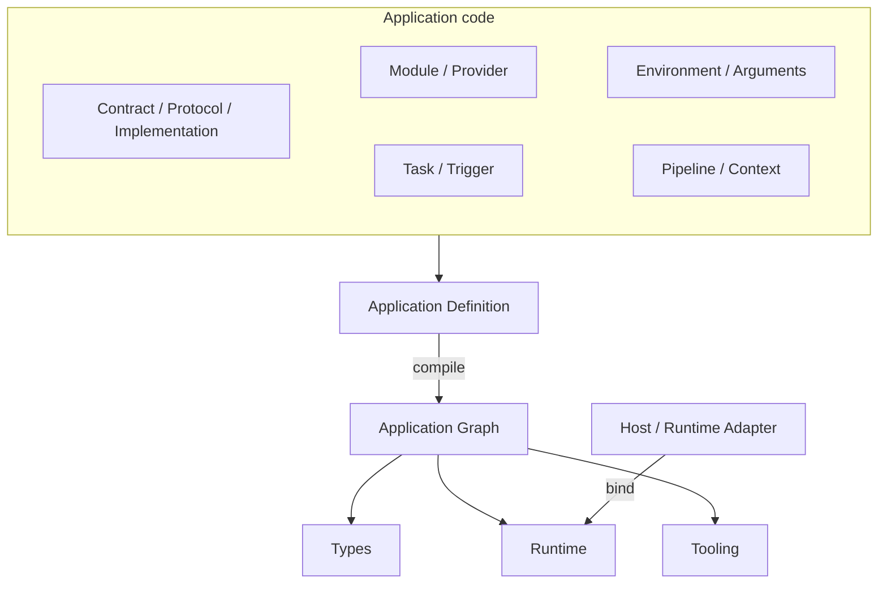

# Loutre Architecture

Loutre's Application is defined as **Application Definition** that does not depend on a specific Runtime.

The **Application Graph** generated from the Definition aggregates information that makes up the Application, such as Module, Provider, Protocol, and Task. Loutre's Type System, Runtime, and CLI work from this same Graph.

On this page, we will take a step-by-step look at how a Loutre Application is configured, turned into a Graph, and executed on the Runtime.

If you are creating your first Application, start with [Getting Started](./getting-started.md).

## Overview



In Loutre, we consider the structure and execution method of an application separately.

Application code is written as a Definition that does not depend on Runtime, and the Host and Runtime Adapter are responsible for connecting to Node.js, Bun, Deno, Cloudflare Workers, etc.

In between is the Application Graph.

Graph includes not only Modules and Providers that make up an Application, but also Protocols, Tasks, Trigger, Pipeline, Runtime Capability, etc.

This configuration has some basic rules.

- Application is declared as one portable Definition
- Register Protocol procedure, public Task, Trigger as Execution Root in Graph
- Resources owned by Application are managed by DI
- Data for each request and message is passed in typed Context
- Separate Runtime-specific processing such as listener, process, and deployment from application code.
- Unusable features should not be exposed to the TypeScript API as much as possible
- Graph construction completes synchronously and without side effects

By having the Type System, Runtime, and Tooling share the same Graph, there is no need for each to interpret the Application structure separately.

## Packages

Loutre separates packages for each role.

| Package            | Role                                             |
| ------------------ | ------------------------------------------------ |
| `@loutrejs/loutre` | Application Definition, Graph, Runtime, Protocol |
| `@loutrejs/node`   | Node.js Runtime Adapter                          |
| `@loutrejs/bullmq` | BullMQ Queue Consumer Driver                     |
| `@loutrejs/cli`    | Graph inspection, build, OpenAPI generation      |
| `create-loutre`    | Application starter generation                   |

Core package `@loutrejs/loutre` exposes subpaths for each use.

| Subpath                         | Role                                    |
| ------------------------------- | --------------------------------------- |
| `@loutrejs/loutre`              | Core, Module, DI, Task, Trigger         |
| `@loutrejs/loutre/host`         | Runtime-neutral `bootstrap()`           |
| `@loutrejs/loutre/binding`      | Host, invocation, resource binding      |
| `@loutrejs/loutre/graph`        | Application Graph and diagnostics       |
| `@loutrejs/loutre/runtime`      | Runtime, Lifecycle, Capability metadata |
| `@loutrejs/loutre/http`         | HTTP Protocol, Layer, Client            |
| `@loutrejs/loutre/message-port` | MessagePort Protocol                    |
| `@loutrejs/loutre/openapi`      | OpenAPI 3.2 generation                  |
| `@loutrejs/loutre/presentation` | Presentation at startup                 |
| `@loutrejs/loutre/runtime/*`    | Adapter per Runtime                     |

Application Graph is assembled as regular JavaScript/TypeScript.

You don't need a compiler package just to generate a Graph, TypeScript compiler API, decorator metadata, or `reflect-metadata`.

## Application Definition

`defineApplication()` defines the entire Application configuration.

```text
Application Definition
├ modules[]
├ arguments?
├ tasks[]
├ triggers[]
└ logger?
```

Definition represents what the Application consists of.

It does not have execution API like `init()`, `run()`, `fetch()`, `listen()`, `close()`. Also, listeners and timers will not be started just by importing the Definition.

```ts
const application = defineApplication({
  modules: [UsersModule],
})
```

What actually starts the Application is the Host and Runtime Adapter.

This separation allows the same Definition to be used not only for runtime execution, but also for Graph inspection, testing, OpenAPI generation, and deployment tooling.

## Contract, Protocol, and Implementation

Interaction with the outside world consists of three things: Contract, Protocol, and Implementation.

### Contract

Contract is a collection of Procedures.

Each Procedure statically defines the information required for execution, such as input, response, Pipeline, dispatch identity, and Protocol descriptor.

### Protocol

A Protocol connects a Procedure to external interactions such as HTTP or MessagePort.

For example, in the case of HTTP Protocol, it is responsible for HTTP-specific processing such as routing, request decoding, and response finalization.

There is no need for Core or Application Graph to understand the HTTP route syntax itself. It is handled through descriptors published by the Protocol.

### Implementation

Implementation is the implementation of Procedure defined in Contract.

```ts
const UsersController = implementation({
  name: 'UsersController',
  contract: UsersContract,
  protocol: http,

  factory: (users = inject(UsersService)) => ({
    async get(ctx) {
      return ctx.response.found({
        body: await users.get(ctx.params.id),
      })
    },
  }),
})
```

Implementation consists of static descriptor and synchronous factory.

You can check Contract and Protocol from Descriptor, and collect Dependency Graph from factory.

Names such as `Controller` and `Handler` can be used freely on the Application side. Loutre Core does not treat them as separate component types.

Implementation factory is built once per ApplicationRuntime. It is not a model that creates a new Implementation for each request or message.

Processes with shared resources and lifecycles, such as database connections, are placed in the Provider, and Implementation is concentrated on the implementation of the Procedure.

## Modules

Module is a boundary for organizing applications into features.

```text
Module
├ imports
├ environment
├ providers
├ implementations
├ exports
├ lifecycle
└ required capabilities
```

For example, with the Users feature, the Providers and Implementations required for Users can be combined into one module.

To use a Provider in another module, `exports` from the module that defines the Provider, and `imports` from the user side.

There is no need to export Providers that are used only within the same Module.

This relationship is also recorded in the Application Graph and verified at compile time.

Therefore, whether it can be simply imported from TypeScript and whether it can be used across Application module boundaries are treated separately.

## Project structure

Loutre does not require a specific filesystem layout, but the official starter and examples follow a recommended structure based on feature and integration boundaries.

```text
src/
├ app.ts
├ main.ts
├ config/
│  └ env.ts
├ users/
│  ├ contract.ts
│  ├ controller.ts
│  └ repository.ts
├ database/
│  └ postgres.ts
└ layers/
   └ transaction.ts
```

Use these rules as the default:

- Keep `app.ts` for root Module wiring and the Application Definition. Business logic should live outside it.
- Keep `main.ts` for connecting the Application to a Runtime Adapter.
- Put Runtime inputs such as Environment and Arguments under `config/`.
- Organize domain and integration code by feature or boundary, such as `users/`, `auth/`, or `database/`, rather than global type directories such as `controllers/` or `providers/`.
- Put cross-cutting Pipeline behavior under `layers/` when its primary role is execution composition rather than the feature or infrastructure it depends on. Authentication, authorization, transactions, tenancy, and similar Context-producing or guarding behavior are typical examples.
- Keep resource Providers such as a database connection in their integration directory and execution Layers such as a transaction Context in `layers/`, even when the Layer injects that Provider.
- Keep a schema or domain model separate from a Repository when both represent meaningful concepts on their own. Request and response schemas that only describe one Contract can stay with that Contract.
- Do not create a file only because a Loutre primitive exists. Small declarations that represent one behavior can stay together; for example, a private Task used only by its Trigger does not need a separate file.
- Keep tests close to the behavior they verify. Application-boundary tests can stay next to `app.ts`; feature-specific tests can live with the feature.

The filesystem is therefore a reflection of the same boundaries expressed by the Application Graph: features and integrations own domain and resource code, while `layers/` makes cross-cutting execution behavior explicit. Loutre primitives still describe roles inside those boundaries; they do not require one directory per primitive.

## Providers and Dependency Injection

Provider is a resource owned by Application.

Class, value, factory, conditional Provider, Environment, Arguments, etc. are handled in the same Dependency Graph.

Normally, use `application` scope, which shares an instance across the entire application, and select `transient` only when a new instance is required for each resolution.

Both class token and custom token can declare dependencies with `inject()`.

```ts
const DATABASE = token<Database>('database')

class UserRepository {
  constructor(readonly database = inject(DATABASE)) {}
}
```

In a class, the default parameter of the constructor becomes the dependency declaration.

This way, Loutre can collect the Dependency Graph, and unit tests can directly replace dependencies as regular constructor arguments.

No dedicated Test Container or decorator is required.

Factory Provider uses `inject` metadata.

```ts
provide(CACHE).useFactory({
  inject: [Config],
  use: (config) => new Cache(config),
})
```

`inject()` is not a Service Locator that retrieves dependencies from anywhere in the Application.

Available only while the Framework is assembling the object.

On the other hand, data for each execution such as request, session, current user, tenant, and permissions is handled by Context instead of Provider.

## Synchronous construction

Loutre keeps object construction synchronous so that the Application Graph can be constructed before Application execution.

The following factories and constructors complete synchronously.

- Provider constructor
- Provider factory
- Implementation factory
- Layer factory
- Task factory

The generated runtime function can be asynchronous.

```ts
const task = task({
  factory:
    (service = inject(Service)) =>
    async () => {
      await service.run()
    },
})
```

During construction, the following processes are not performed:

- network I/O
- start listener
- start long-running timer
- process-wide state changes
- business operation

Resource initialization such as Database connection is placed in Lifecycle, and actual business logic is placed in Protocol, Task, and Trigger.

This rule allows Loutre to examine the Graph without starting the Application.

## Runtime Input

The values that Application receives from Runtime are converted to types through Environment and Arguments.

There is no need to read Runtime-specific APIs like `process.env` directly from your application code.

## Environment

Environment is more than just a `process.env` wrapper.

A Contract that converts the raw environment received from Runtime into a type used by the Application.

Standard Schema is used for validation and transformation.

```ts
const AppEnvSchema = z
  .object({
    DATABASE_URL: z.string(),
    STORAGE_DRIVER: z.enum(['memory', 's3']),
  })
  .transform((raw) => ({
    databaseUrl: new URL(raw.DATABASE_URL),
    storageDriver: raw.STORAGE_DRIVER,
  }))

class AppEnv extends defineEnv(AppEnvSchema) {}
```

Application code handles the value after transformation.

```ts
AppEnv.key('databaseUrl')
```

Modules can declare the required Environment Contract.

The Runtime Adapter defaults to a natural environment source for each runtime.

| Runtime Adapter                   | Default source             |
| --------------------------------- | -------------------------- |
| `nodeRuntime.create()`            | `process.env`              |
| `bunRuntime.create()`             | `Bun.env`                  |
| `denoRuntime.bind()` / `create()` | `Deno.env.toObject()`      |
| `cloudflareWorkersRuntime.bind()` | Worker's `environment`     |
| `awsLambdaRuntime.bind()`         | `process.env`              |
| `electronRuntime.attach()`        | `process.env` if available |

If you explicitly pass `environment`, that value takes precedence.

This allows you to use the Application source while keeping it separate from the Runtime-specific Environment API.

## Arguments

Arguments are structured inputs that the Host passes when launching the Application.

Application has 0 or 1 Arguments Contract.

```ts
class AppArgs extends defineArgs(
  z.object({
    workers: z.number().int().positive(),
  }),
) {}

const application = defineApplication({
  modules: [],
  arguments: AppArgs,
})
```

Arguments are also validated and transformed using Standard Schema, and can be used as a provider from Application.

For Applications with required Arguments, the `arguments` option on the Host side will also be required on TypeScript.

The specific values of Environment and Arguments are Runtime inputs, not inputs for creating the Graph itself.

If a deployment unique value or secret is required during Graph inspection, Loutre treats the area beyond that as an opaque boundary and retains the Graph that was obtained up to that point.

## Execution Roots

The location where execution can be started from the Application Graph is called the Execution Root.

```text
Execution Root
├ Protocol procedure
├ Public Task
└ Trigger
   ├ cron
   ├ fixed-delay
   └ queue-consumer
```

Even though the points of entry are different, such as HTTP requests, explicit task execution, and cron, they utilize the same Application Graph and Runtime.

## Tasks

Task is a process that can be executed explicitly from the host.

```ts
const processOrder = task<Order, void>({
  name: 'orders.process',

  factory:
    (service = inject(OrderService)) =>
    async (order) => {
      await service.process(order)
    },
})
```

The Task itself can be defined with a static descriptor and a synchronous factory, and the runtime function returned from the factory can be asynchronous.

Tasks registered to `Application.tasks` become public tasks and can be executed from Hosted Application `run()`.

Tasks used only within Trigger exist in Graph and Runtime, but are not exposed to the public API.

If the Application does not have a public task, `run()` will not appear in the Hosted Application type.

Loutre's basic policy is to make operations that cannot be executed not visible in TypeScript, rather than as runtime errors.

## Triggers

Trigger is the entry point for automatically executing a task.

Loutre Core currently handles the following Trigger models.

- `cron`
- `fixed-delay`
- `queue-consumer`

`cron` uses 5-field expression and IANA timezone to set execution overlap policy.

`fixed-delay` counts the next delay after the previous execution completes.

`queue-consumer` validates the received payload using Standard Schema and then passes it to Task.

The Queue itself is placed in the Core as a vendor-neutral logical resource, and the Driver is in charge of connecting to the actual queue system such as BullMQ.

We do not forcefully abstract transport-specific functions such as retry and delayed publish into one common API.

## Pipeline and Context

A Pipeline constructs the execution order of Protocol procedures.

```text
Pipeline
├ Layer
├ Layer
│  └ child Pipeline
│     ├ Validation
│     └ Layer
└ Terminal
```

Context is passed to the next process by combining Layer, Validation, and Terminal.

Layers are defined with static metadata and synchronous factories.

```ts
const CURRENT_USER = contextField<{ currentUser: User }>('currentUser')

const auth = layer({
  name: 'auth',
  requires: [SESSION],
  provide: CURRENT_USER,

  factory:
    (users = inject(UserService)) =>
    async (ctx, next) => {
      const currentUser = await users.resolve(ctx.session)
      await next({ currentUser })
    },
})
```

`requires` represents the Context Fields required by the layer, and `provide` represents the single Context Field added to subsequent processing. A Layer can provide at most one Context Field.

Runtime detects Context operations such as:

- Access to undeclared property
- Missing required Context Field
- Duplicate Context Field
- Implicit overwriting of existing Context

The layer calls `next()` only once or terminates the Pipeline with `shortCircuit()`.

There is also one Terminal for each Pipeline.

This allows the Pipeline visible on the Application Graph to match the control flow actually flowing in Runtime.

While DI deals with application-owned resources, Context deals with execution-specific data.

By separating these two, you can manage provider lifetime and request/message lifetime without mixing them.

## Application Graph

The Application Graph is the data model at the heart of Loutre.

It is generated by combining the static descriptor written in Application Definition and the dependency obtained from synchronous construction.

```text
Application Definition
        │
        ├ Descriptor traversal ── Declared nodes / edges
        │
        └ Graph Probe ─────────── inject() nodes / edges
                         │
                         ▼
                 Application Graph
```

## Declared Graph

Information that can be read without running the factory, such as Module imports, Provider metadata, Contract, Pipeline, Task, Trigger, and Capability, is collected from the descriptor.

## Graph Probe

Graph Probe is used for objects that declare dependencies using `inject()`, such as classes and Implementations.

Perform synchronous construction on the Probe Container and record the dependency edge.

Graph Probe never starts ApplicationRuntime or Lifecycle.

Therefore, constructor and factory may be executed in Graph Probe and actual Runtime initialization respectively.

This is one of the reasons we keep construction side-effect-free.

At a point that cannot be evaluated without specific values for Environment and Arguments, Graph Probe stops searching at that point and leaves behind the nodes and edges obtained so far.

Graph Probe is not a mechanism to statically analyze JavaScript itself.

Dependency relationships are expressed as Application structures through `inject()` and descriptors.

## Using the Graph

The Application Graph includes relationships such as:

- Module and public boundaries
- Provider and token
- Context Field
- Contract
- Pipeline
- Implementation
- Task
- Queue
- Execution Root
- Runtime Capability
- diagnostics

Even if all dependencies cannot be resolved or cycles are found, the parts that can be constructed can be used as a partial graph.

Loutre CLI's `graph`, `check`, `explain`, and `doctor` also use the same compile result.

Application Graph is part of Loutre's Public API. It is treated with the same versioning policy as the main body.

## Binding and Host

Binding is the boundary that converts the Application Definition into an application that can actually be executed.

```ts
binding.invocation({ application, environment, arguments })
binding.host({ application, environment, arguments })
binding.queue(queue, driver)
```

`binding.invocation()` is for short execution boundaries like callbacks and transport bindings.

Provides Protocol execution and ApplicationRuntime, but does not own the Trigger Engine.

`binding.host()` is for long-lived hosts and also manages the Trigger Engine if necessary.

`bootstrap()` is a Runtime-neutral Host API.

Internally, `binding.host()` is used, and for HTTP-capable applications, Web Standard `fetch(request)` is exposed.

It does not own the HTTP listener itself.

The basic APIs of Hosted Applications are as follows:

```text
graph
get()
init()
close()
```

Additional APIs appear only if there is a corresponding functionality in the Application Definition.

```text
public Task     → run(task, ...args)
HTTP            → fetch(request)
Host + Trigger  → triggers.start() / triggers.stop()
```

For example, `fetch()` does not exist in Applications that do not have HTTP.

Since the listener and shutdown mechanisms differ depending on the Runtime, the Runtime Adapter is in charge of these functions instead of the generic host.

## Runtime Adapters

Runtime Adapter connects Loutre's Binding and each Runtime-specific API.

| Runtime            | Public API                        | Owns                           |
| ------------------ | --------------------------------- | ------------------------------ |
| Node.js            | `nodeRuntime.create()`            | Node HTTP server               |
| Bun                | `bunRuntime.create()`             | `Bun.serve()`                  |
| Deno               | `denoRuntime.bind()` / `create()` | fetch binding / `Deno.serve()` |
| Cloudflare Workers | `cloudflareWorkersRuntime.bind()` | Worker `fetch`                 |
| AWS Lambda         | `awsLambdaRuntime.bind()`         | buffered / streaming handler   |
| Electron           | `electronRuntime.attach()`        | MessagePort                    |

Node.js, Bun, Deno's `create()` initializes the Application and `serve()` starts the listener and Trigger.

`close()` stops the listener, drains the execution in progress, and then shuts down the Application.

For callback runtimes like Cloudflare Workers, AWS Lambda, and Electron, bind the Application from the Host entry instead of the Application source.

There is no need to rewrite the Application Definition to match the deployment format.

## Runtime Capabilities

Available functions vary depending on the Runtime.

Loutre records the difference as Capability in the Application Graph.

Capabilities required for the entire application and Capabilities required only by a specific Execution Root can be expressed separately.

`loutre doctor` compares the Capability required by Application Graph and the Capability provided by the selected Runtime.

Capability metadata and Runtime Adapter implementation itself are also separated.

Therefore, just by checking the Graph for a certain Runtime, there is no need to load that Runtime-specific module.

## Initialization and Lifecycle

Simply inspecting the Application Graph will not start ApplicationRuntime.

Runtime initialization occurs after Binding.

```text
Definition evaluation
        ↓
Graph compile / Probe
        ↓
Environment / Arguments binding
        ↓
Schema validation / transform
        ↓
Runtime factory preparation
        ↓
Provider / Module initialization
        ↓
Application ready
```

Participating in the lifecycle are the application-scoped provider and the module lifecycle.

The following objects do not automatically become Lifecycle participants.

- transient Provider
- Environment
- Arguments
- Implementation
- Layer
- Task runtime

The following Lifecycle hooks are available for Provider:

```text
onModuleInit
onApplicationBootstrap
onModuleDestroy
beforeApplicationShutdown
onApplicationShutdown
```

Runtime also tracks active execution.

```text
CREATED → INITIALIZING → RUNNING → STOPPING → STOPPED
                            │          │
                            │          ├ reject new executions
                            │          └ wait for active executions
                            │
                            └ Protocol / Task / Trigger execution
```

`init()` and `close()` are idempotent. Application Context also implements `AsyncDisposable`, so `await using` closes it through the same cleanup path. Provider lifecycle remains `OnModuleInit` / `OnModuleDestroy`; Loutre does not automatically invoke a Provider's `Symbol.asyncDispose` or `Symbol.dispose`.

If initialization fails, started resources are cleaned up in reverse order.

If multiple errors occur during cleanup, they will be grouped together as `AggregateError` and the first error will not stop the rest of the cleanup.

## Protocols

A Protocol is the boundary that connects a Contract's Procedure to an external interaction.

Implementation returns a logical result rather than creating a transport-specific response directly.

It is the Protocol that converts the result into the actual transport response.

Schema validation, serialization, streaming, etc. are also handled by Protocol finalization.

## HTTP

HTTP Protocol uses Web Standard `Request` and `Response` as boundaries.

The main roles are:

- decode path, query, headers, body
- Validation by Standard Schema
- Generate dispatch identity from method and normalized path
- logical response status/schema validation
- Finalization to HTTP response
- stream cleanup on request abort

Path parameter is raw `string` until validation.

Just by declaring Schema, the value will not be automatically converted, and `validate.params` of Pipeline becomes an explicit refinement boundary.

CORS and Basic Auth are also configured using layers and typed contexts, rather than adding special mechanisms outside of the protocol.

HTTP-specific validation errors and preflight responses are finalized by the HTTP Protocol.

## MessagePort

MessagePort also uses the same application model as HTTP.

There is no need to recreate Implementation, Pipeline, Layer, and ApplicationRuntime separately.

`messagePort.handler` becomes the Pipeline Terminal and the Implementation returns a logical MessagePort result.

Electron Runtime Adapter attaches this Protocol execution to Electron MessagePort.

Whether the transport is HTTP or MessagePort, the underlying Application composition and Dependency Graph are the same.

## Tooling

Loutre CLI also utilizes the Application Graph.

The CLI itself does not become the host that starts the application.

Load the Application Definition, compile the Graph, and use it for the next function.

- `graph` — See the relationship between Module, DI, Contract, Execution, and Runtime
- `check` — Check Graph diagnostics
- `explain` — Check the dependency path to a specific node
- `doctor` — Check compatibility with Runtime Capability
- `build` — Generate Application bundle and deployment entry
- `openapi` — Generate OpenAPI 3.2 document

There is no need to start ApplicationRuntime for Graph inspection or OpenAPI generation.

The host is responsible for process lifecycles such as `run`, `dev`, and `start`.

Even when the CLI `build` generates an entry for deployment, bindings for AWS Lambda, Cloudflare Workers, Deno, etc. are generated on the host side.

The application source itself is not rewritten for each deployment target.

## Next steps

After taking a look at Loutre's Architecture, the next step is to try running the actual application.

- [Getting Started](./getting-started.md) — Create your first Application
- [`examples/`](../examples/) — See implementation examples for HTTP, CLI, Worker, etc.
- `docs/adr/` — Read the design decisions behind Architecture
